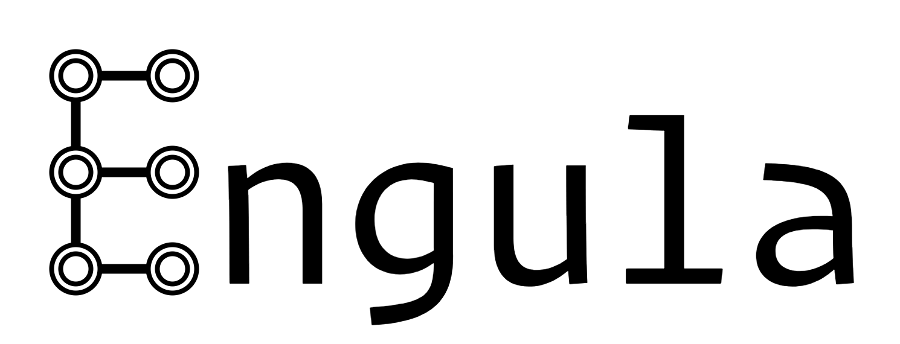

---

Engula is a cloud-native storage engine for next-generation data infrastructures.

Engula is in the demo stage now, welcome to review [the design](docs/design.md) and join [the room](https://gitter.im/engula/contributors) to discuss with us.
You can also **contact careers@engula.com to become a full-time developer!**
