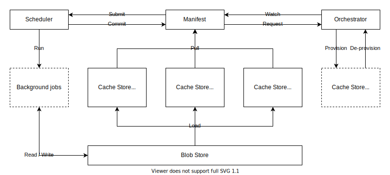

# Engula

Engula is a persistent data structure store, used as a database and storage engine. Engula aims to use one system to serve different kinds of applications well. To achieve this goal, Engula provides a collection of persistent data structures that optimize for specific scenarios. When a new kind of scenario comes up, which doesn't fit into existing data structures, a new data structure can be added to extend Engula's capabilities, leveraging a solid foundation instead of reinventing the wheel from scratch.

Engula provides clients for different programming languages. Applications use a client to convert data operations into requests. Then the client uses RPC to communicate with an Engula service to accomplish the operations. The most important client interfaces are a set of typed collections. A typed collection contains a set of objects of the same type. Each type provides a set of APIs to manipulate objects of that type.

Engula supports ACID transactions to extend its range of applications further. The default isolation is causal snapshot isolation (CSI). To implement CSI, Engula uses hybrid logical clocks (HLC) to order events throughout the system. Engula opts for CSI because it meets the essential requirements of most applications while providing high performance. However, more strict isolations can also be supported by doing more checks on transaction commit.

Engula implements a cloud-native architecture to deliver a cost-effective, highly-scalable, and highly-available service on the cloud. Engula disaggregates compute and storage to allow scaling different kinds of resources on-demand. The compute tier consists of a set of cooperators, each of which serves a portion of data. The storage tier consists of a stream store and an engine store. Cooperators use the stream store to elect leaders and store transaction logs. Committed transactions are first accumulated in cooperators and then flushed to the engine store in batches for persistence. On failures, cooperators read logs from the stream store to recover unflushed transactions. Since all cooperators share the same stream store and engine store, scaling cooperators is lightweight and doesn't induce data movement. Cooperators also cache results of read requests to speed up future reads. This built-in cache, combines with the lightweight scaling, enables Engula to resist hotspots and bursts of traffic.

## Data model

An Engula deployment is called a universe. A universe consists of multiple databases, each of which consists of multiple collections. A collection is a set of objects of the same type. Each object has an object identifier, which is a sequence of bytes and is unique within a collection. Each object provides a set of methods associated with its type to manipulate its state.

A collection can be partitioned (hash or range) into a lot of shards, each of which contains a portion of objects in the collection. Objects are the unit of partitioning, and shards are the unit of data movement.

Engula supports transactions across collections of the same database. However, different databases are independent, which means that transactions across databases are not supported.

## Architecture

Engula implements a tiered architecture. A universe has four tiers: control, service, compute, and storage. The control tier consists of a supervisor and an orchestrator, the service tier consists of a set of transactors, the compute tier consists of a set of cooperators, and the storage tier consists of a stream store and an engine store.

The supervisor assigns data to cooperators and handles automated data movement among them, either to meet replication constraints or to balance load. The supervisor is also responsible for scaling transactors and cooperators through the orchestrator.

Transactors are stateless. Each transactor retrieves and caches location information from the supervisor. Applications use a client to send transactions to one of the transactors. The transactor inspects the transaction and coordinates one or more cooperators to complete the transaction.

Cooperators are divided into groups. Each group serves one or more shards from different collections of the same database. One of the cooperators in a group is elected as a leader, and the others are followers. A group has at least one leader and zero or more followers. Followers can be added on-demand for failover or load balance. For each group, the leader cooperator handles all writes, while all cooperators with up-to-date data can handle reads to share traffic. All cooperators in the same universe use the same stream store and engine store for data persistence.
Moreover, all cooperators also form a built-in cache tier. Each cooperator has two cache components: a read cache and a write cache. The read cache contains data read from the engine store. The write cache contains changes that are not flushed to the engine store.

The stream store and the engine store are two independent storage systems. The stream store manages a lot of single-producer, multi-consumer (SPMC) streams. A stream stores a sequence of events and supports leader election to choose a single producer. The engine store provides functionalities for point gets, range scans, and batch updates.

Each cooperator group uses a dedicated stream in the stream store to elect a leader and store transaction logs. On writes, the leader cooperator append logs to the stream first and then accumulate the changes to the write cache. When the write cache size reaches a threshold, the leader cooperator flushes the changes to the engine store. The engine store applies the changes to update its state. Once the leader cooperator confirms that the changes have been persisted to the engine store, it truncates the corresponding logs in the stream. On reads, a cooperator reads from the read cache first. On cache misses, the cooperator reads the required data from the engine store and fills the read cache. To get the newest data, the cooperator merges data from the read cache or the engine store with the write cache.

## Orchestrator

Engula uses the orchestrator pattern in multiple places. Orchestrator provides an abstraction on the running platform to manage a set of service instances and allows users to provision and de-provision instances on-demand.

Orchestrator makes Engula autonomous. From this point of view, the architecture of Engula can be regarded as the composition of three autonomous systems. The control, service, and compute tiers form one autonomous system, while the stream store and the engine store are the other two autonomous systems.

## Storage

The storage of Engula consists of a stream store and an engine store. The stream store and the engine store are multi-tenant, strongly consistent, highly scalable, and highly available storage systems. Both of them can serve a lot of tenants in one deployment. A stream store tenant manages multiple streams, and an engine store tenant manages multiple buckets. Cooperators of the same database use different streams in a dedicated stream store tenant to store transaction logs. Collections of the same database use different buckets in a dedicated engine store tenant to store objects.

### Stream store

TODO: the previous design of shared journal can be adapted here.

### Engine store

An engine store deployment consists of a manifest, an orchestrator, a scheduler, a blob store, and a set of cache stores. The engine store organizes data into blobs. Blobs are stored in the blob store, which serves as the single point of truth for data. The manifest organizes blobs in each bucket as an LSM-Tree. The manifest is also responsible for managing the set of cache stores and assigning data to them. Each cache store serves a portion of data from one or more buckets. It is possible for multiple cache stores to serve overlapped data to share traffic. It is also important to note that the partitioning of data among cache stores has nothing to do with the partitioning of collections described above. Each cache store loads the portion of data assigned to it from the blob store and serves reads of the corresponding data. In addition, the manifest monitors the load of cache stores to decide the distribution of data and scale cache stores using the orchestrator.

An engine store provides an interface for users to ingest updates. An ingestion can generate one or more blobs to multiple buckets of the same tenant. The manifest decides the layout of blobs in each bucket on ingestion. Since buckets are organized as LSM-Trees, their read and space amplification increase along with ingestions. So the manifest needs to use the scheduler to run background jobs for compaction, compression, and garbage collection.

## Transaction

Ordering: HLC

Isolation: Snapshot Isolation

## Sharding

Split / merge
Load balance, data movement

## Deployment

While the architecture introduces a lot of components, it doesn't mean that each component needs to be deployed as an independent node. For example, it is possible to put all components into a single server for convenience, which works similarly to a traditional, standalone DBMS. However, to maximize the power of the cloud-native architecture, we should separate components with different resource requirements apart.
