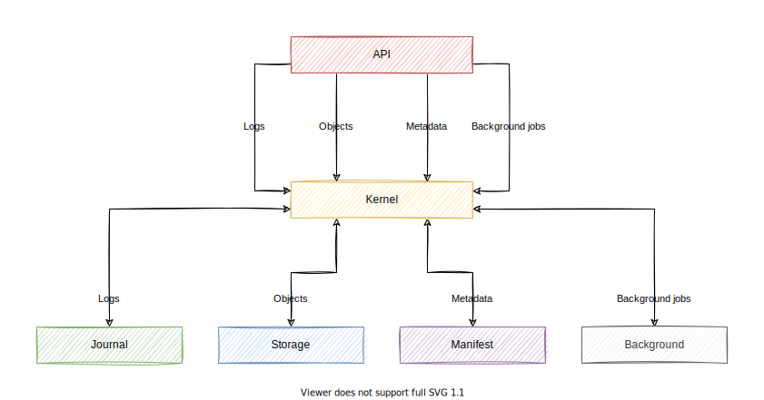

# About

This document describes the top-level design of Engula.

**The current design is still in progress.** You can also check [the previous design][demo-design] for more information.

[demo-design]: https://github.com/engula/engula/blob/demo-1/docs/design.md

# Overview

Engula is a serverless storage engine that empowers engineers to build reliable and cost-effective databases.

Engula's design goals are as follows:

- Elastic: takes advantage of elastic resources on the cloud
- Adaptive: adapts to dynamic workloads and diverse applications
- Extensible: provides pluggable module interfaces and implementations for customization
- Platform independent: allows flexible deployments on local hosts, on-premise servers, and cloud platforms

It is important to note that Engula is not a full-functional database. Engula is more like a framework that allows users to build their databases or storage engines. However, for users that don't need customization, Engula can also be used as an out-of-the-box data service for typical applications.

# Architecture

Engula employs *a modular and serverless architecture*.

Engula unbundles the storage engine into the following modules:

- **Engine** provides storage engines for different database workloads.
- **Kernel** provides stateful environments to implement upper-level storage engines.
- **Journal** provides abstractions and implementations to store data streams. For example, transaction logs.
- **Storage** provides abstractions and implementations to store data objects. For example, SSTables or Parquet tables.
- **Background** provides abstractions and implementations to run background jobs. For example, compactions or garbage collections.

These modules have varied resource requirements, which allows Engula to take advantage of different kinds of resources. Engula intends to shift most foreground computation to `Engine`, background computation to `Background`, and then make the cost of stateful modules (`Kernel`, `Journal`, and `Storage`) as low as possible.

Engula modules also expose extensible interfaces that allow different implementations. Engula provides some built-in implementations for common use cases. For example, `Storage` offers a local implementation based on the local file system and a remote implementation based on gRPC services. For a specific application, users can choose the appropriate implementations or build their own ones.

As for deployment, unlike traditional databases and storage engines, Engula modules are not aware of nodes or servers. From the perspective of Engula, all modules run on a unified resource pool with unlimited resources. The resource pool divided resources into resource groups, each of which consists of multiple resource units that can be scaled on-demand. Each kernel instance runs on a dedicated resource group to provide an isolated stateful environment for upper-level storage engines.

# Engine

A well-optimized storage engine needs to make a lot of assumptions about its applications. While these assumptions allow targeted optimizations, they also limit the range of applications. That's why we need different kinds of storage engines. However, despite the varied assumptions, the storage requirements of these engines are surprisingly similar. This observation motivates Engula to be a ubiquitous framework that empowers all kinds of storage engines.

In Engula, `Engine` interacts with `Kernel` to accomplish various kinds of storage operations. The interaction between `Engine` and `Kernel` can be generalized as follows:

For writes:

- `Engine` converts client requests into transaction logs
- `Engine` persists the logs in `Kernel` and then applies them to a memory table
- `Engine` flushes the memory table to `Kernel` and then deletes the obsoleted logs
- `Engine` submits some background jobs to `Kernel` periodically to re-organize persisted data

For queries:

- `Engine` converts client requests into low-level data queries
- `Engine` merges data in the memory table and data from `Kernel` to serve these queries
- `Engine` optionally caches data from `Kernel` to optimize read performance

# Kernel

`Kernel` is a stateful and pluggable environment for storage engines. A `Kernel` implementation integrates different modules to provide a specific set of storage capabilities. For example, a memory kernel stores everything in memory, and a file kernel stores everything in local files.

Specifically, `Kernel` stores streams in `Journal`, objects in `Storage`, metadata in `Manifest`, and runs background jobs in `Background`. In addition, `Kernel` supports versioned metadata and atomic metadata operations to meet the following requirements:

- Commit metadata across objects and modules atomically
- Access consistent metadata snapshots of the storage engine
- Make sure that the required data remains valid during requests processing

To achieve that, `Kernel` maintains multiple versions of metadata. Each version represents the state of `Kernel` at a specific time. Each metadata transaction creates a version update that transforms the last version into a new one. When an engine connects to `Kernel`, it gets the last version from `Kernel` as its base version and subscribes to future version updates. When a version update arrives, the engine applies it to its base version to catch up with `Kernel`. The engine maintains a list of live versions for ongoing queries and releases a version once it is no longer used. `Kernel` needs to guarantee that objects in all engine versions remain valid until the corresponding versions are released.

`Manifest` provides a single point of truth for `Kernel`. To add objects, `Kernel` uploads objects to `Storage` first and then commits the uploaded objects to `Manifest`. To delete objects, `Kernel` commits the to be deleted objects to `Manifest` before deleting those objects. It is possible that `Kernel` fails to upload or delete some objects. In this case, the corresponding objects are obsoleted and left in `Storage`. So `Kernel` implements garbage collection to purge deleted and obsoleted objects eventually.

# Journal

`Journal` divides data into streams. A stream stores a sequence of events. Each stream has a unique identifier called the stream name. Events within a stream are ordered by timestamps. Users are responsible for assigning increasing timestamps to events when appending to a stream. However, timestamps within a stream are not required to be continuous, which allows users to dispatch events to multiple streams.

## Semantic

`Journal` provides the following interfaces to manipulate streams:

- List streams
- Create a stream with a unique name
- Delete a stream

`Journal` provides the following interfaces to manipulate events in a stream:

- Read events since a timestamp
- Append events with a timestamp
- Release events up to a timestamp

It is also possible to support stream subscriptions. We leave the exploration of this feature to future work.

Released events can be archived or garbage collected. Whether released events are accessible depends on the implementation. For example, if events are archived, it should allow users to recover data from archives. Nevertheless, implementations should guarantee to return continuous events. That is, the returned events must be a sub-sequence of a stream.

## Implementation

`Journal` can be implemented in the following forms:

- `Local Journal`: stores data in memory or local file system.
- `Remote Journal`: stores data in multiple remote services with some kind of consensus.
- `External Journal`: stores data in various third-party services like Kafka or LogDevice.

`Journal` doesn't assume how data should be persisted. It is up to the implementer to decide what guarantees it provides.

# Storage

`Storage` divides data into buckets. A bucket stores a set of data objects. Each bucket has a unique identifier called the bucket name. Each object has an object name that is unique within a bucket. Objects are immutable once created.

## Semantic

`Storage` provides the following interfaces to manipulate buckets:

- List buckets
- Create a bucket with a unique name
- Delete a bucket

`Storage` provides the following interfaces to manipulate objects in a bucket:

- List objects
- Upload an object
- Delete an object
- Read some bytes from an object at a specific position

It is also possible to support object-level expression evaluation for some object formats (e.g., JSON, Parquet), which is important to analytical workloads. We leave the exploration of this feature to future work.

`Storage` is a low-level abstraction to manipulate individual objects. It doesn't support atomic operations across multiple objects. See [`Kernel`](#kernel) for more advanced semantics.

## Implementation

`Storage` can be implemented in the following forms:

- `Local Storage`: stores data in memory or local file system.
- `Remote Storage`: stores data in multiple remote services with some kind of replication or load balance.
- `External Storage`: stores data in various third-party services, for example, S3 or MinIO.

It is a good idea to combine different implementations into a more powerful one. For example, we can create a hybrid storage that persists data to a slow but highly-durable storage and then reads data from a fast and highly-available storage.

`Storage` doesn't assume how data should be persisted. It is up to the implementer to decide what guarantees it provides.

# Discussions

Casual discussions about the design can proceed in the following discussions:

- [Architecture][architecture-discussion]
- [Engine][engine-discussion]
- [Journal][journal-discussion]
- [Storage][storage-discussion]

[architecture-discussion]: https://github.com/engula/engula/discussions/41
[engine-discussion]: https://github.com/engula/engula/discussions/55
[journal-discussion]: https://github.com/engula/engula/discussions/70
[storage-discussion]: https://github.com/engula/engula/discussions/79

Formal discussions about the design of a specific implementation should proceed with an [RFC](rfcs).
