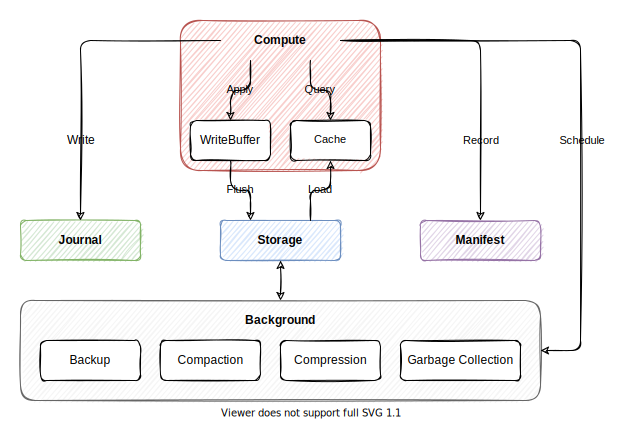

# About

Status: Draft

This document describes the top-level design of Engula.

This document is evolving from [the previous design document][demo-1-url].
You can check that document for more details before this document is thorough.

[demo-1-url]: https://github.com/engula/engula/blob/demo-1/docs/design.md

# Data Model

An Engula deployment is called a universe. A universe contains multiple databases. A database contains multiple collections.

A `Collection` represents a collection of data in a database. Applications use data APIs to manipulate data in collections. Engula provides some built-in data APIs for convenience. Applications can also build their data APIs outside of Engula.

# Architecture

Engula employs *an unbundled architecture*. Engula unbundles the storage engine into different components. Each component can be run as a local component or a remote component. Local components are embedded in applications, which work like other embedded storage engines. Remote components are standalone services that interact with applications through RPC. Each remote component is served by a group of isolated resource units provisioned from a resource pool.

Engula consists of five components: `Compute`, `Journal`, `Storage`, `Manifest`, and `Background`.

`Compute` handles commands and queries from clients. It has an embedded `WriteBuffer` and `Cache`.

To handle a command, `Compute` writes the command to `Journal` and then applies it to `WriteBuffer`. When the size of `WriteBuffer` reaches a threshold, `Compute` flushes `WriteBuffer` to `Storage` and records the metadata to `Manifest`.

To handle a query, `Compute` tries to query the result from `Cache` first. On cache misses, `Compute` loads the required data from `Storage`.

Periodically, `Compute` may schedule some background jobs to reorganize data in `Storage`. `Compute` dedicates the execution of background jobs to `Background`, which doesn't interfere with foreground service.

# Storage Structure

The storage of a database consists of a `BaseStore` and a `DeltaStore`.

The `BaseStore` stores data files of a database. The `BaseStore` uses a `Manifest` to record the layout and metadata of data files. Data files of a database are divided into collections but can be atomically committed to the `Manifest`.

The `DeltaStore` stores recent updates of a database. The `DeltaStore` uses a `Journal` to persist updates and a `WriteBuffer` to accumulate updates. The `DeltaStore` is optional. Applications that tolerate the loss of recent updates can ignore the `DeltaStore`.
