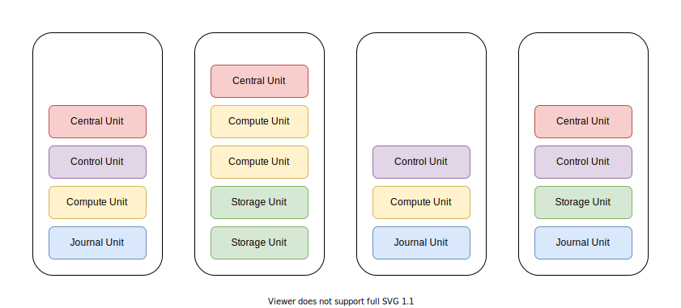

# Engula

This document describes the top-level design of Engula.

## Overview

Engula is a cloud-native storage engine.
Engula aims to provide reliable and high-performance storage with minimal cost.
To achieve this goal, Engula is designed from scratch to take full advantage of elastic resources.

The design principles of Engula are as follows:

- Make it simple and reliable, then make it cost-effective and high-performance.
- Make it smart that requires minimal operation and configuration.
- Avoid external dependencies that are not built-in the platforms.

## Data Model

Engula exposes a semi-structured data model with rich data types to support diverse applications.

An Engula deployment is called a universe.
A universe contains multiple databases, which in turn contain multiple collections.
A collection is a set of key-value records versioned with timestamps.

Record keys are sequences of bytes, while record values can be of various types.
Engula supports primitive types (numbers, strings), compound types (unions, structs), and collection types (maps, lists).
Consider that some real-world applications need to store lots of elements in a single record, Engula will optimize records of collection types that contain millions of elements.

Engula supports atomic updates of a single record as well as ACID transactions across records within a database.
However, records of different databases are independent of each other, which means that interoperations between different databases are not possible.

## Architecture

Engula is designed to be a cross-platform and vendor-independent storage engine.
While the detailed designs for different platforms are varied, this document describes the general cloud-native architecture of Engula.
In this document, we assume that the running platform supplies elastic resources and provides APIs to provision and de-provision different types of nodes.

For more details about the design and implementation of Engula for a specific platform, see the following documents (TODO):

- Embedded Engine
- Amazon Web Services

### Unit

Engula employs a [microunit](https://github.com/engula/microunit) architecture to leverage elastic resources.
Engula decomposes its functionalities into different kinds of units:

- Supreme Unit
- Central Unit
- Compute Unit
- Journal Unit
- Storage Unit
- Background Unit

A unit is a lightweight container that runs on a node and possesses a certain amount of resources on that node.
Different units have varied resource characteristics.
For example, some are CPU-bound while some are IO-bound.
The decomposition allows Engula to allocate optimal combinations of resources to different units according to their characteristics.
It is also possible to extend Engula with custom units and let Engula take care of the deployment.
That said, Engula can be considered as a unit orchestration system.

A group of units can form a replication group to provide reliable service.
A replication group runs the Paxos consensus algorithm and elects a leader to process commands.
The details about Paxos can be found in related papers and will not be further discussed in this document.

A node manages a set of units and exposes APIs to provision and de-provision units on demand.
The node maintains a list of units provisioned on it.
On restart, the node resumes the execution of all provisioned units.
Nodes can be tagged with different attributes and units can choose to run on nodes with specific attributes.

The overall architecture and the behaviors of individual units are described below.

### Universe

An Engula universe consists of a set of nodes provisioned from the running platform.
These nodes serve as a unified resource pool for the universe.
The universe architecture is as follow:

When a universe is bootstrapped, a group of supreme units is created.
These supreme units form a replication group that is capable of fail-over and self-repair.
If the leader supreme unit fails, the followers will start elections to elect a new leader.
If one follower supreme unit fails, the leader will provision a new supreme unit to replace the broken one.

A supreme unit stores a replica of the universe metadata on the local file system.
The leader supreme unit is responsible for the universe and manages the metadata and databases for it.

### Database

An Engula database consists of a set of units: central units, compute units, journal units, storage units, and background units.
Units of different databases do not interact with each other at all.
The relationship between units within a database can be simplified as follow:

When a database is created, the leader supreme unit registers the database and then provisions a group of central units to manage it.
These central units form a replication group that is capable of fail-over and self-repair like the supreme units.

A central unit stores a replica of the database metadata on the local file system.
The leader central unit is responsible for the database and manages the metadata and a dedicated set of units for it.

Although the central unit manages different kinds of units in different ways, there are some common principles:

- Scale units that are overloaded or underloaded.
- Monitor the health of individual units and replace broken ones.

While the central unit serves as the housekeeper of a database, other units are responsible for client data storage and command execution.
The persistent state of a database consists of two parts: the journal and the storage.
The journal is a log system that stores incremental update logs and the storage is a file system that stores immutable files.

#### Journal

The journal architecture is as follow:

The journal of a database can be divided into one or more shards.
Each shard manages one or more hash or range partitions of the journal.

A group of journal units is responsible for the storage of one shard.
These journal units act as acceptors and learners in the consensus algorithm.
A journal unit stores logs on the local file system and exposes APIs to manipulate them.
The journal unit employs asynchronous IO and group commit to process logs with minimal CPU consumption.

A group of compute units is responsible for the command execution of one or more shards.
The leader compute unit acts as the distinguished proposer in the consensus algorithm.
If a shard has no leader, for example, on restart, the central unit assigns a leader to it.

Shards can be split, merged, and transferred between compute units for load balance.

**To split a shard:**

- Assume that shard A is the shard to be split. After the split, shard A keeps one part of the origin shard and a new shard B contains the other part.
- The central unit provisions a new group of journal units for shard B and hands it over to the leader compute unit of shard A.
- The compute unit chooses a split point based on the load distribution of shard A and executes a transaction on both shards.
- Once the transaction has been committed, the compute unit split traffics of the origin shard to the two shards.
- On failure, the compute unit retries or aborts the transaction according to the situation.

Note that there is no data movement during a split because the compute unit manages data of both shards and previous logs of the origin shard will be discarded or archived when the corresponding data has been flushed. The data flow will be described in the execution section later.

**To merge two shards in the same group:**

- To merge shard B into shard A, the leader compute unit executes a transaction on both shards.
- Once the transaction has been committed, the compute unit merge traffics of the origin shards to shard A.
- On failure, the compute unit retries or aborts the transaction according to the situation.
- After the merge, shard B is kept alive until all its logs have been discarded or archived. Then the central unit can de-provision the journal units of shard B.
- To merge shards in different groups, transfer these shards into one group first.

**To transfer a shard between two groups:**

- The leader compute unit of the source group (the source) notifies the leader compute unit of the target group (the target) about the transfer.
- If the memtable of the shard is small, the source replicates it to the target.
- If the memtable of the shard is large, the source flushes it to the storage.
- In either case, the source forwards new updates to the target until the memtable has been replicated or flushed.
- When the target catches up, the source pulls the trigger, notifies the target to take over, and resigns the leadership of the shard.
- Then the target starts an election to become the leader of the shard.
- If the target misses the notification for some reason, the central unit will notice that the shard has no leader and assign a new one to it.

#### Storage

The storage architecture is as follow:

Files of a database include a manifest and a set of data files organized into collections.
The manifest records the file layout of each collection in the database.
Collections can choose appropriate file structures to optimize for different workloads.

A manifest consists of a manifest file and a manifest journal.
The manifest file records the base version of the manifest.
The manifest journal records a sequence of version edits on the base version.
When the size of the manifest journal reaches a threshold, the manifest journal is merged with the manifest file to form a new manifest file.

The manifest file and all data files are immutable and replicated in the storage units, while the manifest journal is replicated in the central units for incremental updates.
The leader central unit is responsible to maintain the manifest and distribute files among storage units.

A storage unit stores immutable files on the local file system and exposes APIs to add, drop, and read files.
The storage unit is designed to be as reliable and cost-effective as possible.
The storage unit relies on the cache of the file system and doesn't introduce an additional cache.
We leave performance optimization to the upper level, which has more application context to make better decisions.

The storage unit also records access statistics for each file and reports them to the central unit.
The central unit calculates the hotness of files from these statistics to balance file distribution.
For example, the central unit can add more replicas for hot files in the fast storage tier to share traffics, while keeping cool files in the slow storage tier to save cost.

In addition, the central unit schedules background jobs to reorganize files in storage units.
For example, the central unit can schedule compactions to merge files with overlapped ranges to improve read performance.
The central unit can also schedule compressions or garbage collections to reduce storage usage.
When a background job is scheduled, the central unit provisions a background unit to run it.
Since the background job is fault-tolerant and will not affect foreground services even if it fails, the background unit can be run with unreliable but cheap resources to save cost.

#### Execution

The leader compute unit is responsible to process client commands for the shards it manages.
The command execution flow is as follow:

To handle writes, the compute unit replicates the updates to journal units of the corresponding shard.
Then updates are applied to the memtable and forwarded to followers for fast fail-over.
When the size of the memtable reaches a threshold, the memtable is flushed to the storage and a memtable is created.

To handle reads, the compute unit merges updates in the write buffer with data from the local cache or the remote storage.
The compute unit queries data from the local cache first.
If the required data is not in the local cache, the compute unit reads from the remote storage instead and then fills the local cache.
Followers can also serve as read replicas to share read traffics.

To further improve performance, the following optimizations can be introduced:

- Introduce a dedicated cache tier to address read hotspots.
- Aggregate concurrent commands of a single record and execute them at once to deal with single-point hotspots.

#### Transaction

**TODO: transaction**

Engula supports causal snapshot isolation.

More strict isolation levels are possible, but for most web-scale applications, causal snapshot isolation should be good enough.
