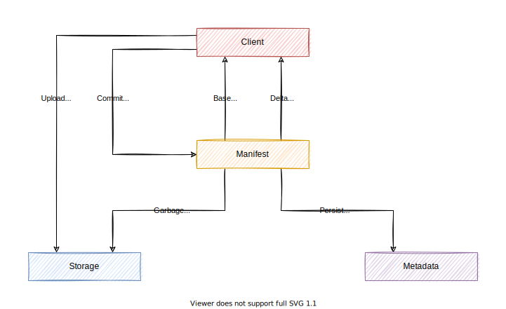

# About

This document describes the top-level design of Engula.

The current design is still in progress. You can also check [the previous design][demo-design] for more information.

[demo-design]: https://github.com/engula/engula/blob/demo-1/docs/design.md

# Overview

Engula is a serverless storage engine that empowers engineers to build reliable and cost-effective databases.

Engula's design goals are as follows:

- Elastic: takes advantage of elastic resources on the cloud
- Adaptive: adapts to dynamic workloads and diverse applications
- Extensible: provides pluggable APIs and modules for customization
- Platform independent: allows flexible deployments on local hosts, on-premise servers, and cloud platforms

It is important to note that Engula is not a full-functional database. Engula is more like a framework that allows users to build their databases with less effort and more confidence. However, for users that don't need customization, Engula can also be used as an out-of-the-box data service for typical applications.

# Architecture

Engula employs *a modular and serverless architecture*.

Engula unbundles the storage engine into the following modules:

- *Compute* runs stateless data API services. For example, KV, SQL, or GraphQL.
- *Journal* is an abstraction to store real-time data streams. For example, transaction logs.
- *Storage* is an abstraction to store immutable data objects. For example, SSTables or Parquet tables.
- *Manifest* is an abstraction on top of Storage to provide versioned metadata and atomic metadata operations.
- *Background* is an abstraction to run background jobs on-demand. For example, compactions or garbage collections.

These modules have varied resource requirements, which allows Engula to take full advantage of different resources. Engula intends to shift most foreground computation to Compute, background computation to Background, and then make the cost of stateful modules (Journal, Storage, and Manifest) as low as possible.

Engula modules also expose extensible APIs that allow different implementations. Engula provides some built-in implementations for common use cases. For example, Storage offers a local implementation based on the local file system and a remote implementation based on gRPC services. For a specific application, users can choose the appropriate implementations or build their own ones. Uses can also use an individual module outside of Engula.

As for deployment, unlike traditional databases and storage engines, Engula modules are not aware of nodes or servers. From the perspective of Engula, all modules run on a unified resource pool with unlimited resources. The resource pool divided resources into resource groups, each of which consists of multiple resource units. A module instance is served by a dedicated resource group, and it can scale the group according to dynamic workloads. The resource pool provides Engula the abilities to provision resource units and groups, discover services, detect failures, etc.

# Journal

Journal divides data into streams. A stream stores a sequence of events. Each stream has a unique identifier called the stream name. Events within a stream are ordered by timestamps. Users are responsible for assigning increasing timestamps to events when appending to a stream. However, timestamps within a stream are not required to be continuous, which allows users to dispatch events to multiple streams.

## Interface

Journal provides the following interfaces to manipulate streams:

- List streams
- Create a stream with a unique name
- Delete a stream

Journal provides the following interfaces to manipulate events in a stream:

- Read events since a timestamp
- Append events with a timestamp
- Release events up to a timestamp

It is also possible to support stream subscriptions. We leave the exploration of this feature to future work.

Released events can be archived or garbage collected. Whether released events are accessible depends on the implementation. For example, if events are archived, it should allow users to recover data from archives. Nevertheless, implementations should guarantee to return continuous events. That is, the returned events must be a sub-sequence of a stream.

## Implementation

Journal can be implemented in the following forms:

- Local Journal: stores data in memory or local file system.
- Remote Journal: stores data in multiple remote services with some consensus.
- External Journal: stores data in various third-party services like Kafka or LogDevice.

Journal doesn't assume how data should be persisted. It is up to the implementer to decide what guarantees it provides.

# Storage

Storage divides data into buckets. A bucket stores a set of data objects. Each bucket has a unique identifier called the bucket name. Each object has an object name that is unique within a bucket. Objects are immutable once created.

## Interface

Storage provides the following interfaces to manipulate buckets:

- List buckets
- Create a bucket with a unique name
- Delete a bucket

Storage provides the following interfaces to manipulate objects in a bucket:

- List objects
- Upload an object
- Delete an object
- Read some bytes from an object at a specific position

It is also possible to support object-level expression evaluation for some object formats (e.g., JSON, Parquet), which is important to analytical workloads. We leave the exploration of this feature to future work.

Storage is a low-level abstraction to manipulate individual objects. It doesn't support atomic operations across multiple objects. See [Manifest](#manifest) for more advanced semantics.

## Implementation

Storage can be implemented in the following forms:

- Local Storage: stores data in memory or local file system.
- Remote Storage: stores data in multiple remote services with local balance.
- External Storage: stores data in various third-party services, for example, S3 or MinIO.

It is a good idea to combine different implementations into a more powerful one. For example, we can create a hybrid storage that persists data to a slow but highly-durable storage and then reads data from a fast and highly-available storage. We can also create a tiered storage that separates data with different hotness into multiple tiers to provide different cost-performance trade-offs.

Storage doesn't assume how data should be persisted. It is up to the implementer to decide what guarantees it provides.

# Manifest

Manifest enhances Storage with versioned metadata and atomic metadata operations to meet the following requirements:

- Foreground services that need to make sure that the required data remains valid during processing
- Background jobs that need to add or delete multiple objects atomically to guarantee data correctness

Manifest manages object data in Storage and persists object metadata in Metadata. To add objects to Manifest, a client uploads objects to Storage first and then commits the uploaded objects to Manifest. To delete objects from Manifest, a client commits the to be deleted objects to Manifest and then relies on Manifest to purge those objects. It is possible that a client fails to upload some objects or fails to commit the uploaded objects. In this case, the corresponding objects become obsolete. So Manifest implements garbage collection to guarantee that deleted and obsoleted objects will be purged sooner or later.

Manifest employs a multi-version mechanism to manage metadata. It maintains multiple versions of metadata. Each version represents a snapshot of metadata at a specific time. Each metadata transaction (add or delete objects) creates a version update that transforms the last version into a new one. When a client connects to Manifest, it gets the last version from Manifest as its base version and subscribes to future version updates. When a version update arrives, the client applies it to its base version to catch up with Manifest. The client maintains a list of live versions for ongoing queries and releases a version once it is no longer used. Manifest guarantees that objects in all client versions remain valid until the corresponding versions are released.

# Discussions

Casual discussions about the design can proceed in the following discussions:

- [Overall architecture][overall-discussion]
- [Journal design and implementation][journal-discussion]
- [Storage design and implementation][storage-discussion]

[overall-discussion]: https://github.com/engula/engula/discussions/41
[journal-discussion]: https://github.com/engula/engula/discussions/70
[storage-discussion]: https://github.com/engula/engula/discussions/79

Formal discussions about the design of a specific implementation should proceed with an [RFC](rfcs).
