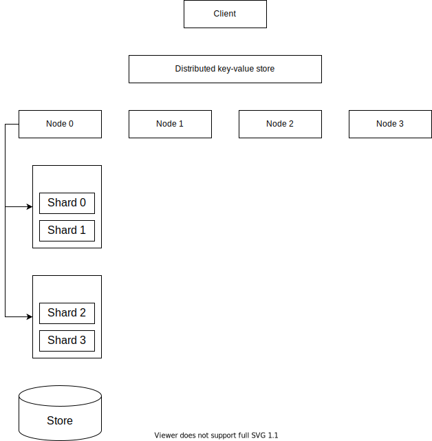

# Engula

This document describes the top-level design of Engula.

Engula is a distributed key-value store.

## Data model

An Engula deployment is called a cluster. A cluster serves multiple databases, each of which consists of multiple collections. A collection contains a set of key-value pairs that are partitioned (hash or range) into shards. Keys are the unit of data partition, and shards are the unit of data movement.

## Architecture

## Bootstrap

A cluster is bootstrapped when the first node is started. The first node creates an init group (group 0).

## Init group

An init group is the first group created when a cluster is bootstrapped. An init group has group id 0.

An init group serves an internal database named system. The system database consists of some collections:

- nodes: contains node descriptors
- groups: contains group descriptors
- shards: contains shard descriptors
- databases: contains database descriptors
- collections: contains collection descriptors

## Node management

### Add a node

To add a node to a cluster, a client sends a request with a node descriptor to the init group. The init group allocates a unique node id to the node and adds the node descriptor to the nodes collection.

### Remove a node

To remove a node from a cluster, a client sends a request with the target node id to the init group. The init group creates a task to move replicas from the target node to other nodes. When the task finishes, the init group removes the target node descriptor from the nodes collection.

## Group management

## Shard management

## Database management

### Create a database

To create a database, a client sends a request with a database descriptor to the init group. The init group allocates a unique database id to the database and adds the database descriptor to the databases collection.

## Collection management

### Create a collection

To create a collection, a client sends a request with a collection descriptor to the init group. The init group allocates a unique collection id to the collection and adds the collection descriptor to the collections collection.

A collection consists of at least one shard. The init group needs to assign the shards of a collection to some groups when a collection is created.