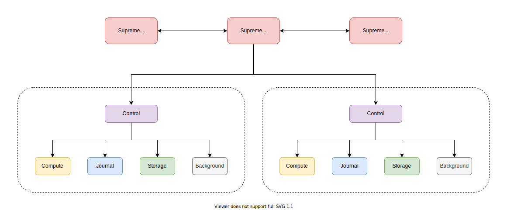
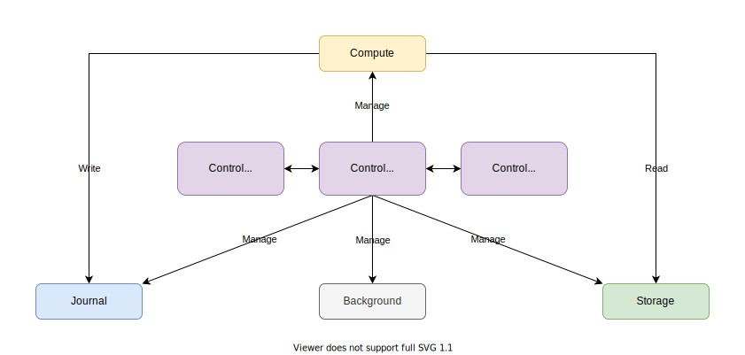
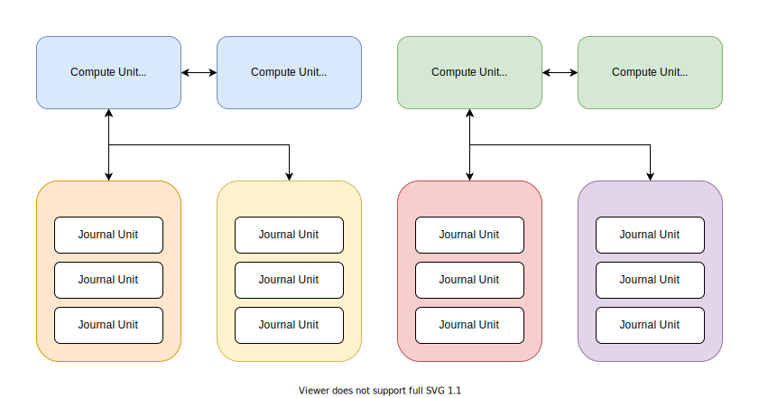
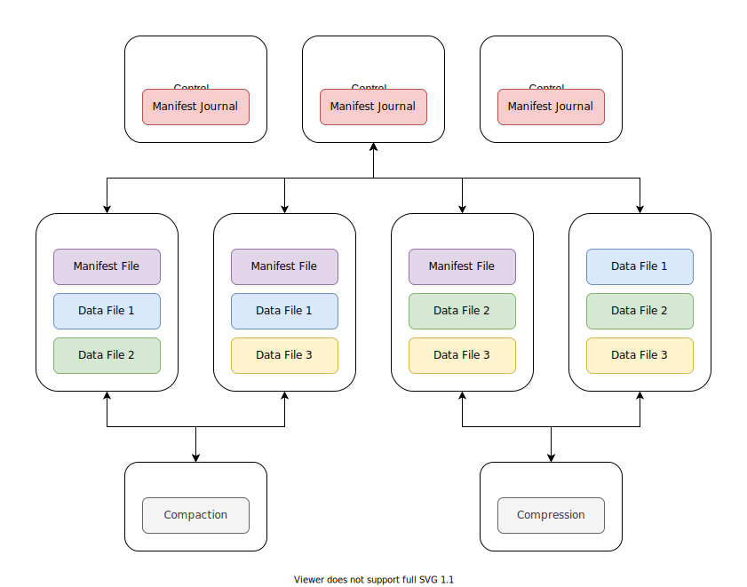
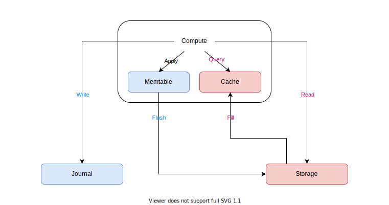

# Engula

This document describes the top-level design of Engula.

## Overview

Engula is a cloud-native storage engine.
Engula aims to provide reliable and high-performance storage service with minimal cost on cloud platforms.
Cloud platforms provide elastic resources that can be provisioned and de-provisioned on demand, which opens a wide range of opportunities to re-architect the storage engine to exploit it.
To achieve this goal, Engula is designed from scratch to take full advantage of elastic resources on these platforms.

Engula unbundles components of a classic storage engine into single-function units.
For example, some units are responsible for data storage, while some are responsible for command execution.
Each unit is a lightweight container that runs on a node and possesses a certain amount of resources on that node.
Nodes are provisioned from the running platform and constitute a unified resource pool to serve units.
That said, Engula can be regarded as a unit orchestration system that provides storage service as a whole.

The design principles of Engula are as follows:

- Make it simple and reliable first, then make it cost-effective and high-performance.
- Make it smart enough that requires minimal operation and configuration.
- Avoid external dependencies that are not built-in the platforms.

## Data Model

Despite being cloud-native, Engula is still a general-purpose storage engine.
Engula exposes a semi-structured data model with rich data types to support diverse applications.

An Engula deployment is called a universe.
A universe contains multiple databases, which in turn contain multiple collections.
A collection is a set of key-value records versioned with timestamps.

Record keys are sequences of bytes, while record values can be of various types.
Engula supports scalar types (numbers, strings), compound types (unions, structs), and collection types (maps, lists).
Consider that some real-world applications need to store lots of elements in a single record, Engula will optimize records of collection types that contain millions of elements.

Engula exposes a far more rich set of APIs to manipulate data than existing storage engines.
Each data type supports a dedicated set of APIs to manipulate values of that type.
For example, numeric types support arithmetic operations like addition and subtraction, collection types support operations to insert, update, and delete a single element.

Engula supports atomic updates to a single record as well as ACID transactions across multiple records within a database.
However, records of different databases are independent of each other, which means that interoperations between different databases are impossible.

## Architecture

Engula is cross-platform and vendor-independent.
Although the detailed design of Engula depends on the specific platform, this document describes the general cloud-native architecture.
In this document, we assume that the running platform supplies elastic resources and provides APIs to provision and de-provision nodes.

For more details about the design and implementation of a specific platform, see the following documents (TODO):

- Embedded Engine
- Amazon Web Services

Engula employs a [microunit](https://github.com/engula/microunit) architecture to exploit elastic resources.

Engula decomposes its functionalities into different kinds of units:

- Supreme Unit
- Control Unit
- Compute Unit
- Journal Unit
- Storage Unit
- Background Unit

These units have varied resource requirements.
For example, some are CPU-bound while some are IO-bound, some require reliable resources while some don't.
The decomposition allows Engula to allocate optimal combinations of resources to different units according to their characteristics.
It also empowers developers to extend Engula with custom units that leverage these built-in units to provide higher-level services.

An Engula universe consists of a set of nodes provisioned from the running platform.
These nodes are homogeneous and each one can serve all kinds of units as long as the node meets a unit's resource requirement.
In addition, nodes can be tagged with different attributes so that units can choose to run on nodes that have specific attributes.
Each node exposes APIs to provision and de-provision units on it and maintains a list of provisioned units.
On restart, the node resumes the execution of all provisioned units and recovers their previous state if possible.

### Universe

The relationships between different kinds of units in a universe are as follows:

The supreme unit is responsible for the top-level management of a universe.
It exposes APIs to create, delete, and configure databases.
It also monitors the load and health of the universe to provision and de-provision nodes on demand.

The control unit is responsible for the top-level management of a database under the supreme unit.
It manages a set of other units that are dedicated to a database.
Units of different databases are independent and do not interact with each other.
The details about individual units in a database are described later.

When a universe is bootstrapped, a group of supreme units is created.
These supreme units form a replication group that is capable of fail-over and self-repair.
Each supreme unit stores a replica of the universe metadata on the local file system.
A leader supreme unit is elected to process commands and maintain the metadata.
If the leader fails, followers will start elections to elect a new leader.
If some follower fails, the leader will provision a new supreme unit to replace it.

Engula implements a consensus algorithm based on Raft and Paxos.
The details about the consensus algorithm will be described in another document.

### Database

The relationships between different kinds of units in a database are as follows:

When a database is created, the supreme unit registers the database and provisions a group of control units for it.
These control units form a replication group that is capable of fail-over and self-repair like the supreme units.
The control unit serves as the housekeeper of a database.
Although the control unit manages different kinds of units in different ways, there are some common principles as well:

- Scale units that are overloaded or underloaded.
- Monitor the health of individual units and replace broken ones.

The control unit exposes APIs to create, delete, and configure collections.
Collections of the same database share the same set of units.
The compute unit is responsible to process client commands and persist data to the journal unit and the storage unit.
The journal and the storage together consist of the persistent state of a database.

#### Journal

The journal is a log system that stores incremental updates for a database.
The journal architecture is as follow:

The journal of a database is divided into one or more shards.
Each shard manages one or more hash or range partitions of the journal.

A group of journal units is responsible for the storage of one shard.
Each journal unit stores logs on the local file system and exposes APIs to manipulate them.
The journal unit employs asynchronous IO and group commit to process logs with minimal CPU consumption.

A group of compute units is responsible for the command execution of one shard.
The leader compute unit acts as the distinguished proposer in the consensus algorithm.
If a shard has no leader, for example, on restart, the control unit assigns a leader to it.

Shards can be split, merged, and transferred between compute units for load balance.

**To split a shard:**

- Assume that shard A is the shard to be split. After the split, shard A keeps one part of the origin shard and a new shard B contains the other part.
- The control unit provisions a new group of journal units for shard B and hands it over to the leader compute unit of shard A.
- The compute unit chooses a split point based on the load distribution of shard A and executes a transaction on both shards.
- Once the transaction has been committed, the compute unit split traffics of the origin shard to the two shards.
- On failure, the compute unit retries or aborts the transaction according to the situation.

Note that there is no data movement during a split because the compute unit manages data of both shards and previous logs of the origin shard will be discarded or archived when the corresponding data has been flushed. The data flow will be described in the execution section later.

**To merge two shards in the same group:**

- To merge shard B into shard A, the leader compute unit executes a transaction on both shards.
- Once the transaction has been committed, the compute unit merge traffics of the origin shards to shard A.
- On failure, the compute unit retries or aborts the transaction according to the situation.
- After the merge, shard B is kept alive until all its logs have been discarded or archived. Then the control unit can de-provision the journal units of shard B.
- To merge shards in different groups, transfer these shards into one group first.

**To transfer a shard between two groups:**

- The leader compute unit of the source group (the source) notifies the leader compute unit of the target group (the target) about the transfer.
- If the memtable of the shard is small, the source replicates it to the target.
- If the memtable of the shard is large, the source flushes it to the storage.
- In either case, the source forwards new updates to the target until the memtable has been replicated or flushed.
- When the target catches up, the source pulls the trigger, notifies the target to take over, and resigns the leadership of the shard.
- Then the target starts an election to become the leader of the shard.
- If the target misses the notification for some reason, the control unit will notice that the shard has no leader and assign a new one to it.

#### Storage

The storage is a file system that stores immutable files for a database.
The storage architecture is as follow:

A database contains a manifest and a set of data files organized into collections.
The manifest records the metadata of each file and the file layout of each collection.
Collections can use different file structures to optimize for specific workloads.

A manifest consists of a manifest file and a manifest journal.
The manifest file records the base version of the manifest, which describes the persistent database state in the storage.
The manifest journal records a sequence of version edits applied on the base version.
When the size of the manifest journal reaches a threshold, the manifest journal is merged with the manifest file to form a new base version.

The manifest file and all data files are immutable and replicated in the storage units, while the manifest journal is replicated in the control units for incremental updates.
The control unit is responsible to maintain the manifest and distribute files among storage units.

A storage unit stores immutable files on the local file system and exposes APIs to add, drop, and read these files.
The storage unit is designed to be as reliable and cost-effective as possible.
For example, it relies on the cache of the file system and doesn't introduce an additional cache.
We leave performance optimization to the upper level, which has more application context to make better trade-offs.

The storage unit also records access statistics for each file and reports them to the control unit.
The control unit calculates the hotness of individual files from these statistics to balance file distribution.
For example, the control unit can add more replicas for hot files in the fast storage tier to share traffics, while keeping cool files in the slow storage tier to save cost.

In addition, the control unit can schedule background jobs to reorganize files in storage units.
For example, the control unit can schedule compactions to merge files with overlapped ranges to improve read performance.
The control unit can also schedule compressions or garbage collections to reduce storage usage.
When a background job is scheduled, the control unit provisions a background unit to run it.
Since the background job is fault-tolerant and will not affect foreground services even if it fails, the background unit can be served with unreliable but cheap resources to save cost.

#### Execution

The leader compute unit is responsible to process client commands for the shards it manages.
The command execution flow is as follow:

To handle writes, the compute unit replicates the updates to journal units of the corresponding shard.
Then updates are applied to the memtable and forwarded to followers for fast fail-over.
When the size of the memtable reaches a threshold, the memtable is flushed to the storage and a memtable is created.

To handle reads, the compute unit merges updates in the write buffer with data from the local cache or the remote storage.
The compute unit queries data from the local cache first.
If the required data is not in the local cache, the compute unit reads from the remote storage instead and then fills the local cache.
Followers can also serve as read replicas to share read traffics.

To further improve performance, the following optimizations can be introduced:

- Introduce a dedicated cache tier to address read hotspots.
- Aggregate concurrent commands of a single record and execute them at once to deal with single-point hotspots.

#### Transaction

**TODO: transaction**

Engula supports causal snapshot isolation.

More strict isolation levels are possible, but for most web-scale applications, causal snapshot isolation should be good enough.
