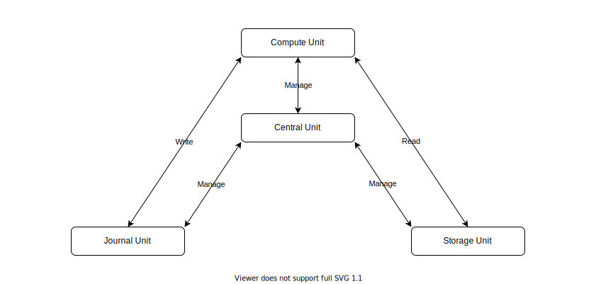
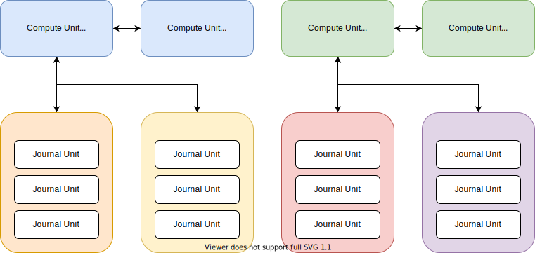
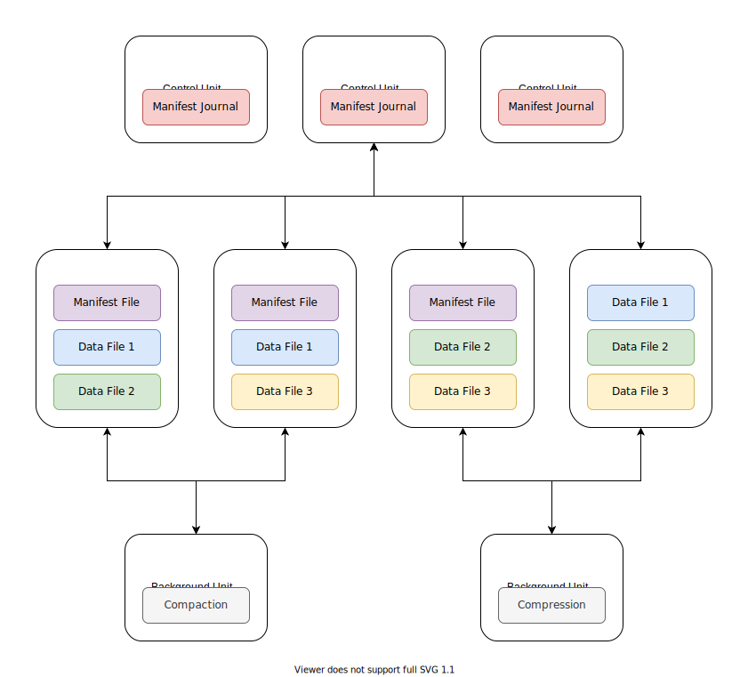

# Engula

This document describes the top-level design of Engula.

## Principles

The design principles of Engula are as follows:

- Avoid designs that are too complicated for long-term support.
- Avoid external dependencies that are not built-in the platforms.

## Data Model

Engula exposes a semi-structured data model with rich data types to support diverse applications.

An Engula deployment is called a universe.
A universe contains multiple databases, which in turn contain multiple collections.
A collection is a set of key-value records versioned with timestamps.

Record keys are sequences of bytes while record values can be of various types.
Engula supports primitive types (e.g. numbers, strings), compound types (e.g. structs), and collection types (e.g. maps, lists).
Consider that some real-world applications need to store a lot of elements (e.g. relationships) in a single record, Engula will provide optimization for collection types with millions of elements.

Engula supports atomic updates of a single record, as well as ACID transactions across records and collections within a database.
However, records of different databases are independent of each other, which means that interoperations between different databases are not possible.

## Architecture

Engula is a general-purpose storage engine that runs on various platforms.
While the detailed design of Engula depends on a specific platform, this document describes the general design of Engula's cloud-native architecture.
In this document, we assume that the running platform supplies elastic resources and provides APIs to provision and de-provision nodes.

For more details about the design and implementation of Engula on a specific platform, see the following documents:

- Embedded Storage Engine
- Amazon Web Services

### Unit

Engula employs a microunits architecture to take advantage of elastic resources.
Engula decomposes its functionalities into different kinds of units:

- Central Unit
- Control Unit
- Compute Unit
- Journal Unit
- Storage Unit

These units have different resource characteristics, for example, some are CPU-bound and some are IO-bound.
The decomposition allows Engula to allocate appropriate resources to different units according to their characteristics.

A unit runs on a node and possesses a certain amount of resources (e.g. CPU, IO) on the node.
A group of units can form a replication group to provide reliable service.
A replication group runs the Paxos consensus algorithm and elects a leader to process commands.
The details about Paxos can be found in related papers and will not be further discussed in this document.

We will introduce the overall architecture next and describe the behaviors of individual units after that.

### Universe

An Engula universe consists of a set of nodes provisioned from the running platform.
Each node manages a set of units and exposes APIs to provision and de-provision units on demand.
The universe architecture is as follow:

When a universe is bootstrapped, a group of central units is created.
These central units form a replication group and the leader central unit is responsible to store metadata and manage databases for the universe.

### Database

An Engula database consists of four kinds of units: control units, compute units, journal units, and storage units.
Units of different databases do not interact with each other at all.
The relationship between units of a database is as follow:

When a database is created, the leader central unit allocates a group of control units for it.
Then the leader control unit takes over to store metadata and manage a dedicated set of units for the database.

The persistent state of a database consists of two components: the journal and the storage.
The journal is a log system that stores logs and the storage is a file system that stores immutable files.

#### Journal

The journal architecture is as follow:

Logs of a database can be divided into one or more shards.
Each shard manages one or more hash or range partitions of the database.

A group of journal units is responsible for the storage of one shard.
Journal units act as acceptors and learners in the consensus algorithm.
A group of compute units is responsible for the compute of one or more shards.
The leader compute unit acts as the distinguished proposer in the consensus algorithm.

#### Storage

The storage architecture is as follow:

Files of a database include a manifest and a set of data files organized into collections.
The manifest records the file layout of each collection in the database.
Collections can choose varied file structures to optimize for different workloads.

A manifest consists of a manifest file and a manifest journal.
The manifest file records the base version of the manifest.
The manifest journal records a sequence of version edits on the base version.
When the size of the manifest journal reaches a threshold, the manifest journal is merged with the manifest file to form a new manifest file.

The manifest file and all data files are immutable and replicated in the storage units, while the manifest journal is replicated in the control units for incremental updates.
The leader control unit is responsible to maintain the manifest, balance files among storage units, and schedule background jobs to reorganize files.

### Central Unit

The central unit is the supreme unit in an Engula universe.
The central unit stores metadata of the universe on the local file system and exposes APIs to manage databases.

When a database is created, the leader central unit replicates the database metadata and then provisions a group of control units to manage the database.

The central unit is so simple that the resources it requires should be negligible.

### Control Unit

The control unit is the supreme unit in an Engula database.
The control unit stores metadata of the database on the local file system and exposes APIs to manage the database.

The control unit requires a small amount of CPU, IO, and storage.

### Compute Unit

The compute unit is responsible to process client commands.

The compute unit requires a large amount of CPU but no IO or storage at all.

### Journal Unit

The journal unit stores logs on the local file system and exposes APIs to append, archive, and truncate logs.

The journal unit employs asynchronous IO and group commit to handle a lot of logs with minimal CPU consumption.

The journal unit requires a small amount of CPU, a large amount of IO, and a medium amount of storage.

### Storage Unit

The storage unit stores immutable files on the local file system and exposes APIs to add, drop, and read these files.

The storage unit is designed to be as reliable and cost-effective as possible and leaves performance optimization to the upper level, which has more context about the application.
Therefore, the storage unit relies on the cache of the file system and doesn't introduce additional cache.

The journal unit requires a small amount of CPU and a large amount of IO and storage.
