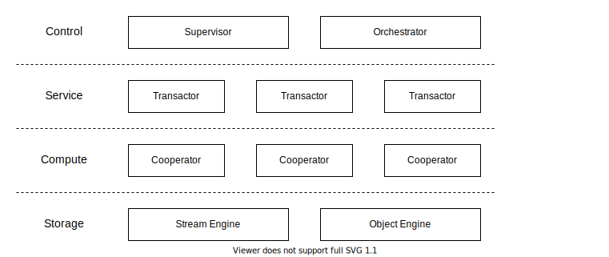

# About

Status: Draft

This document describes the top-level design of Engula.

This document is evolving from [the previous design document][demo-1-url].
You can check that document for more details before this document is thorough.

[demo-1-url]: https://github.com/engula/engula/blob/demo-1/docs/design.md

# Architecture

Engula employs *an unbundled architecture*. Engula unbundles the storage engine into different components. Each component can be run as a local component or a remote component. Local components are embedded in applications, which work like other embedded storage engines. Remote components are standalone services that interact with applications through RPC. Each remote component is served by a group of isolated resource units provisioned from a resource pool.

Engula consists of five components: `Compute`, `Journal`, `Storage`, `Manifest`, and `Background`.

`Compute` handles commands and queries from clients. It has an embedded `WriteBuffer` and `Cache`.

To handle a command, `Compute` writes the command to `Journal` and then applies it to `WriteBuffer`. When the size of `WriteBuffer` reaches a threshold, `Compute` flushes `WriteBuffer` to `Storage` and records the metadata to `Manifest`.

To handle a query, `Compute` tries to query the result from `Cache` first. On cache misses, `Compute` loads the required data from `Storage`.

Periodically, `Compute` may schedule some background jobs to reorganize data in `Storage`. `Compute` dedicates the execution of background jobs to `Background`, which doesn't interfere with foreground service.
