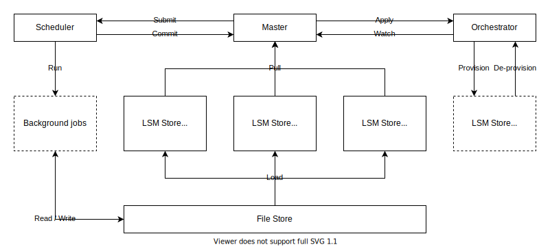

# Engula

Engula is a persistent data structure store, used as a database and storage engine. Engula aims to the standard collections for stateful applications. Engula provides a set of persistent data structures that optimize for specific use cases to serve diverse applications in one system. New data structures can be added for new use cases to extend Engula's capabilities instead of reinventing the wheel from scratch.

Engula provides clients for different programming languages. The most important client interface is a set of typed collections. A typed collection contains a set of objects of the same type. Each type defines the meaning of the data and the operations that can be done on the data. A client converts data operations into internal expressions and then communicates with Engula to execute the expressions.

Engula provides ACID transactions to extend its range of applications further. Engula supports different isolation and consistency levels. The default is read committed (RC) isolation with causal consistency level. This combination meets the requirements of most OLTP applications with high performance. To provide causally consistent reads and writes, Engula uses hybrid logical clocks (HLC) to order events throughout the system.

Engula implements a cloud-native architecture to deliver a cost-effective, highly-scalable, and highly-available service on the cloud. Engula disaggregates compute and storage to allow scaling different kinds of resources on-demand. The compute tier consists of a set of cooperators, each serving a portion of data. The storage tier consists of a stream engine and an object engine. Cooperators use the stream engine to elect leaders and store transaction logs. Committed transactions are first accumulated in cooperators and then flushed to the object engine in batches. On failures, cooperators read logs from the stream engine to recover unflushed transactions. Since all cooperators share the same stream engine and object engine, it is lightweight to scale cooperators without data movement. Cooperators also serve as a built-in cache tier to speed up reads, enabling Engula to resist traffic bursts and hotspots.

## Data model

An Engula deployment is called a universe. A universe consists of multiple databases, each of which consists of multiple collections. A collection contains a set of objects of the same type. Each object has an object identifier, which is a sequence of bytes and is unique within a collection. Each object provides a set of methods associated with its type to manipulate its state. Engula supports common data types in programming languages. For example, numbers, strings, sets, maps, and lists.

A collection can be partitioned (hash or range) into shards, each of which contains a portion of objects in the collection. Shards are the unit of data movement, and objects are the unit of data partition.

Engula supports transactions across collections of the same database. However, different databases are independent, which means that transactions across databases are not supported.

## Architecture

Engula implements a tiered architecture. A universe has four tiers:

- The control tier consists of a supervisor and an orchestrator
- The service tier consists of a set of transactors
- The compute tier consists of a set of cooperators
- The storage tier consists of a stream engine and an object engine

The control tier manages the service tier and the compute tier. The supervisor scales transactors and cooperators on-demand through the orchestrator. The supervisor assigns data to cooperators and handles automated data movement among them, either to meet replication constraints or to balance load.

Transactors are stateless. Transactors retrieve metadata and location information from the supervisor. Each transactor can handle transactions of all databases in the universe. To execute a transaction, a transactor inspects the data involved in the transaction and coordinates one or more cooperators to complete the transaction.

Cooperators are divided into replicated groups. Each group can serve multiple shards of different collections in the same database. In each group, one of the cooperators is elected as a leader, and the others are followers. Each group has at least one leader and zero or more followers. Followers can be added on-demand for failover or load balance. Leader cooperators serve all writes, while all cooperators with up-to-date data can serve reads to share traffic.

Cooperators use the same stream engine and object engine for data persistence. The stream engine and the object engine are two independent storage systems. The stream engine manages a set of single-producer, multi-consumer (SPMC) streams. A stream stores a sequence of events and supports leader election to choose a single producer. The object engine provides functionalities to get, scan, and update objects. In addition, each cooperator has two cache components: a read cache and a write cache. The read cache contains the results of recent reads. The write cache contains the changes of recent writes.

A cooperator group uses a dedicated stream from the stream engine to elect a leader and store transaction logs. On writes, the leader cooperator append logs to the stream first and then accumulate the changes to the write cache. When the write cache size reaches a threshold, the leader cooperator flushes the changes to the object engine. The object engine applies the changes to update its data. Once the leader cooperator confirms that the changes have been persisted to the object engine, it truncates the corresponding logs in the stream. On reads, a cooperator queries from the read cache first. On cache misses, the cooperator reads from the object engine and updates the read cache.

## Orchestrator

Orchestrator provides an abstraction on the running platform to manage a set of server instances. Orchestrator follows the [operator pattern](https://github.com/cncf/tag-app-delivery/blob/main/operator-wg/whitepaper/Operator-WhitePaper_v1-0.md) and can be implemented as an operator in Kubernetes.

An orchestrator implementation should provide the following functionalities:

- Provide information of instances
- Provide health checks on instances
- Allow users to provision and de-provision instances

Engula employs orchestrators to build an autonomous system. From this point of view, the architecture of Engula can be regarded as the composition of three autonomous sub-systems. The control, service, and compute tiers form one sub-system, and the stream engine and the object engine are the other two sub-systems.

## Storage

The storage of Engula consists of a stream engine and an object engine. The stream engine and the object engine are multi-tenant, highly scalable, and highly available storage systems. Both of them can serve a lot of tenants in one deployment. A stream engine tenant manages multiple streams, and an object engine tenant manages multiple buckets. Each database uses one dedicated tenant in the stream engine to store logs and one dedicated tenant in the object engine to store objects.

### StreamEngine

A StreamEngine deployment manages a lot of tenants, each of which consists of multiple streams. A stream stores a sequence of events proposed by users.

A StreamEngine deployment consists of a master, an orchestrator, and a set of segment stores.

The events of a stream are divided into multiple segments, according to a certain strategy, since it's capacity might exceeds the hardware limitation. For fault tolerance and durability, each segments is replicated and persisted in multiple segment stores. The master records the segment placements of streams, and it assigns segment's replica to the segment store and balance load among them.

Only one client as a leader can write events into a stream at the same time. For fault tolerance, multiple clients will try to elect a leader at the same time. The master is responsible for choosing one of these clients as the leader.

### ObjectEngine

An ObjectEngine deployment manages a lot of tenants, each of which consists of multiple buckets. ObjectEngine stores data as files. Files in a bucket are organized as an LSM-Tree.

An ObjectEngine deployment consists of a manifest, an orchestrator, a background scheduler, a file store, and a set of cache stores. All files are persisted in the file store. The file store is highly durable and serves as the single point of truth for data. Each cache store caches a portion of files from the file store to speed up reads. The manifest assigns data to the cache stores and balances load among them. It is important to note that the data distribution in cache stores has nothing to do with the data partition of collections described in the data model section. Multiple cache stores can serve overlapped data to share traffic.

ObjectEngine provides interfaces for users to generate and ingest files. ObjectEngine supports atomic ingestion across buckets in the same tenant. The manifest needs to decide the layout of files in each bucket to maintain the LSM-Tree structure. As file ingestions go on, the manifest needs to re-organize LSM-Tree structures to reduce read and space amplification. The manifest can submit background jobs (e.g., compaction, garbage collection) to the scheduler, which provisions resources on-demand to run the jobs.

## Deployment

While the architecture introduces different components, it doesn't mean that each component must be deployed as an independent node. The separation of concerns allows Engula to provide flexible deployment. For example, it is possible to run all components together as a standalone server for convenience. However, to maximize resource utilization, components with different resource requirements should be separated apart.
