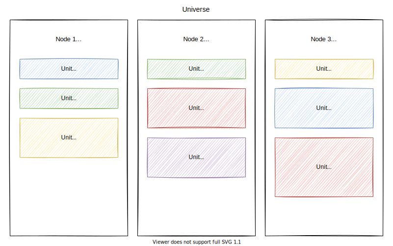

# Microunit

- Status: draft

This document describes the design of microunit.

Microunit is a lightweight unit orchestration framework for Engula.

## Architecture

A microunit deployment is called a universe.
A universe consists of multiple nodes, each of which manages a set of units.

A node is a process running on a virtual or physical machine.
A node owns a certain amount of resources on the machine.
A unit is a child process provisioned from a node.
A unit gets a portion amount of resources from the node.

## Control Plane

A universe is bootstrapped when the first node of the universe starts.
The first node provisions a control unit to take control of the universe.
Later, other nodes can communicate with the control unit to join the universe.

For failover, the control unit replicates itself to multiple nodes.
All control units in a universe form the control plane of the universe.
The control plane runs a consensus algorithm to elect a leader and replicate metadata.

The control plane is responsible for managing the universe.
The control plane pulls information from all nodes to make global decisions about the universe.
