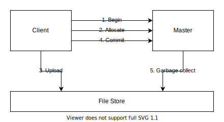

# Object Engine

This document describes the detailed design of Object Engine.

## Architecture

Object Engine consists of a Master, a set of LSM Stores, and a File Store.

Master, LSM Store, and File Store organize files into tenants and buckets. A tenant consists of multiple buckets, and a bucket contains a lot of files.

## Master

### Manifest

Master organizes files in each bucket as an LSM-Tree. The file layout of buckets in a tenant is called a version. Master records the file layout of each tenant in a manifest file. A manifest file is a sequence of version edits ordered by an increasing sequence number. Each version edit contains a bunch of changes (e.g., add or remove files) to one or more buckets based on the previous version. Master reads the manifest file sequentially and applies all version edits to reconstruct the current version of each tenant when it restarts.

### Ingestion

Master supports atomic file ingestions to multiple buckets in the same tenant. To ingest files, a client asks Master to begin an ingestion first. The client allocates unique file names from Master and then uploads files to File Store. When all files are uploaded, the client asks Master to commit the ingestion. During the ingestion, Master tracks the ingestion state and keeps the allocated files alive until the client commits or times out. The ingestion state stays in memory and will be lost when Master restarts. So when an ingestion commits, if its state is missing in Master, it will be simply aborted. When an ingestion commits, Master decides the file layout of the ingested files and appends a new version edit to the manifest file. Finally, due to various failure cases (e.g., client timeouts), some files may be left uncommitted in File Store. So Master runs garbage collection periodically to clean up obsolete files.

### Load balance

Master divides a bucket into multiple partitions with similar sizes. Each partition represents a partial LSM-Tree of the bucket. Master scatters partitions to LSM Stores for load balance. When Master assigns a partition to an LSM Store, it sends a version edit containing the file layout of the partition to the LSM Store. The file layout of each partition changes from time to time due to file ingestions or background jobs. So every time a transaction commits, Master sends a version edit with the corresponding changes to each affected LSM Store. Master doesn't need to persist the distribution of partitions at run time. It pulls information from all LSM Stores to reconstruct the current distribution of partitions when it restarts.

### Background jobs

TODO

## LSM Store

LSM Store is an LSM-Tree storage system built on File Store. LSM Store uses an external File Store as a data source and an optional local File Store as a cache. LSM Store is responsible for managing files in the local store (if present) but not the external store.

LSM Store organizes files in each bucket as an LSM-Tree similar to Master. At run time, LSM Store maintains a list of live versions for each tenant. The current version is at the end of the list. For reads, LSM Store provides key-value APIs for point gets and range scans. To prevent the required files from being deleted during reads, LSM Store acquires a reference of the current version before reading. LSM Store releases the version once the read is done. When the reference count of a version drops to zero, obsoleted files in the version will be deleted. For writes, LSM Store accepts version edits from Master. When a version edit arrives, if a local store is used, LSM Store loads the required files from the external store to the local store and deletes obsoleted files from the local store. Then LSM Store appends the version edit to a local manifest file.

## File Store

File Store is a file storage system. File Store provides file APIs for random reads and sequential writes. There are two kinds of File Store implementations: local and external.

A local store is built on a local file system. It provides low-latency IO with limited storage capacity. A local store is suitable for real-time workloads.

An external store is built on an external storage system (e.g., S3, HDFS). It provides low-cost and highly-durable storage with unlimited capacity. But its IO latency is potentially high and unstable. An external store is suitable for backups and offline workloads.
