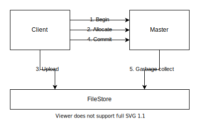

# Object Engine

This document describes the detailed design of Object Engine.

## Architecture

Object Engine consists of a Master, a File Store, and a set of Cache Stores.

Master, File Store, and Cache Stores organize files into tenants and buckets. A tenant consists of multiple buckets, and a bucket contains a lot of files.

## Master

Master supports atomic file ingestions across multiple buckets of the same tenant. To ingest files, a client asks Master to begin a transaction first. Then the client allocates file numbers from Master and then uploads files to File Store. When all files are uploaded, the client asks Master to commit the transaction. During the transaction, Master maintains the transaction state in memory and keeps the allocated files alive until the client commits or times out. The transaction state may be lost when Master restarts. If a transaction commits, but its state is missing in Master, it will be simply aborted. Finally, due to various failure cases (e.g., client timeouts), some files may be left uncommitted in File Store. So Master runs garbage collection periodically to clean up those obsoleted files.

Master organizes files in each bucket as an LSM-Tree. For each tenant, Master records the file layout of each bucket in a manifest file. A manifest file is a sequence of version edits ordered by an increasing sequence number. Each version edit may contain some changes (e.g., add or remove files) to multiple buckets of the same tenant. On restart, Master reads the manifest file sequentially and applies all version edits to reconstruct the current state. When a transaction commits, Master needs to decide the file layout of each bucket and appends a version edit to the manifest file.

Master also manages a set of Cache Stores. Master divides bucket files into multiple partitions with similar sizes. Each partition contains a portion of the LSM-Tree. Master scatters partitions to Cache Stores for load balance. When Master assigns partitions to a Cache Store, it constructs a version edit containing the file layout of each partition and sends the version edit to the Cache Store. The file layout of each partition may change due to file ingestions or background compactions. So every time a transaction commits, Master needs to calculate some version edits and send them to each affected Cache Store. Master only maintains the distribution of partitions in memory. On restart, Master pulls information from all Cache Stores to reconstruct the current distribution of partitions.

## File Store

File Store is a highly-durable file storage system. File Store provides low-cost, unlimited storage capacity with potentially high latency.

File Store provides file APIs for random reads and sequential writes.

## Cache Store

Cache Store is a file cache system built on top of File Store to provide low-latency reads.

Cache Store organizes files in a bucket as an LSM-Tree similar to Master. At run time, CacheStore maintains a list of live versions. The last version in the list is the current version. On reads, Cache Store acquires a reference of the current version to prevent the required files from being deleted during processing. Cache Store releases the version once the reads are done. When the reference count of a version drops to zero, obsoleted files in the version can be deleted. On writes, Cache Store applies a version edit on the current version to create a new version at the end of the version list.

All version edits come from Master. When a version edit arrives, Cache Store loads the missing files from File Store and then appends the version edit to the manifest file.
