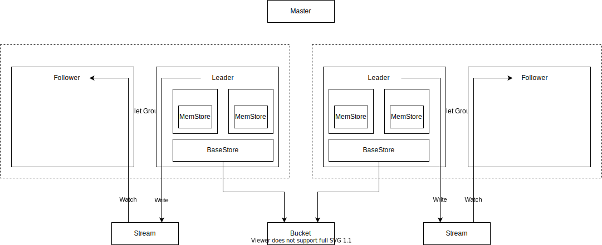

# Luna Engine

- Status: draft
- Discussion: https://github.com/engula/engula/discussions/195

## Overview

Luna engine is a transactional key-value storage engine.

Luna engine is an Engula module and is built on other low-level Engula modules. This document assumes that readers have understanded related Engula concepts like `Kernel`, `Journal`, and `Storage`.

Although Luna can be used as an embedded engine, this document focus on the disaggregated architecture.

## Data Model

A Luna deployment is called a universe. A universe consists of multiple databases, each of which consists of multiple collections. A collection contains a set of key-value pairs. A collection that can be partitioned into tablets. A tablet is the unit of data distribution.

Luna supports transactions across collections within a database. Databases within a universe are independent, which means that Luna doesn't support transactions across databases.

TODO:

- Container: a set of related key-value pairs within a collection.

## Data Layout

A collection consists of a `MemStore` and a `BaseStore`. A `MemStore` contains one active memtable and multiple immutable memtables. Immutable memtables are flushed to `BaseStore` as tables. `BaseStore` can organize tables in different ways. For example, a classic LSM-Tree with multiple levels and each level consists of multiple disjoint tables. Tables of a collection are stored as objects in the same `Kernel` bucket. `BaseStore` delegates `Kernel` to schedule background jobs to re-organize tables for performance or garbage collection.

If a collection is partitioned into multiple tablets, then each tablet has a dedicated `MemStore` while all tablets share the same `BaseStore`.

## Architecture

A universe consists of a universe master and a set of tablet servers. Tablet servers are organized into tablet groups. Each tablet group serves a disjoint set of tablets for one or more databases.

A tablet group consists of replicas (tablet servers). A group uses a `Kernel` stream for leader election and commit logs persistance.

The universe master serves as a router and a placement driver. The master knows the distribution of all tablets and is responsible to balance load among tablet groups.

TODO:

- Geo-distribution (available zones)

## Scaling

Luna can be scaled up and scaled out. Scaling up is preferred when possible to avoid tablet relocation and distributed transactions. A powerful instance should be able to serve a database with a few terabytes data. In this case, we don't need to partition the database at all. Even if scaling out is unavoidable, we expect the number of tablet groups of a database to be small.

### Scaling up

There are two ways to scale up:

- If a tablet server is running on a elastic compute instance, we can scale up that instance.
- If the tablet instance can not be scaled up, we can first move a follower to a more performant instance and then transfer leader to that follower.

### Scaling out

To scale out, we need to partition a database (collections) into multiple tablets first. The universe master collects tablets statistics and then decides how to distribute tablets among tablet groups. A tablet can be moved between two tablet groups using a distributed transaction to update some metadata. Since each tablet has its own `MemStore`, before moving a tablet, we should synchronize the `MemStore` between two groups in background and issue a transaction to commit the movement when the target group is almost catching up.

TODO: How to handle logs in stream?
