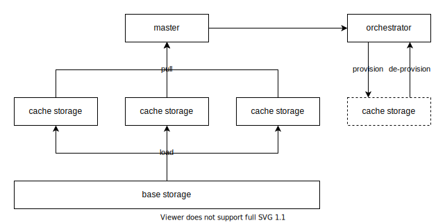

# Shared Storage

- Status: accepted
- Pull Request: https://github.com/engula/engula/pull/247
- Tracking Issue: https://github.com/engula/engula/issues/263

## Summary

This RFC proposes `SharedStorage`, a `Storage` implementation that caches objects from another object storage to improve read performance. `SharedStorage` manages a set of cache storages with a storage orchestrator.

## Motivation

Most object storage services provide high durability and high throughput. But the latency is about tens or hundreds of milliseconds. It is not a problem for background writes, but it is unacceptable for foreground reads of a read-time database. To reduce the read latency, we can add a cache tier on top of an object storage.

## Detailed design

`SharedStorage` consists of a master, a base storage, a set of cache storages, and a storage orchestrator. The base storage is the single point of truth and should offer reliable object storage. The cache storages cache objects from the base storage to improve read performance.

The master serves as a router and a placement driver. It pulls information from all cache storages to form a global view of all objects. Each cache storage collects statistics of objects for the master. The master is then responsible for balancing load among cache storages.

To scale the set of cache storages on-demand, the master provisions or de-provisions cache storages from the orchestrator. The orchestrator maintains the list of cache storages for the master. The orchestrator is also responsible for detecting and recovering faulted cache storages.

### Read path

To read an object, a client contacts the master to get a list of locations that serve the object. If the object is not cached, the client reads from the base storage and then notifies the master to cache the object for future reads.

### Write path

To write an object, a client contacts the master to get a list of locations to store the object. The client must ensure that the object has been persisted in the base storage before claiming a successful write. The client can further ensure that the object has been cached to avoid reading from the base storage later.

### Implementation

A base storage can be built on a cheap and highly reliable cloud object storage(e.g., AWS S3). A cache storage can be a custom-built storage service that stores data on local SSD or cloud block storage (e.g., AWS EBS). An orchestrator can be built on Kubernetes, which acts as an operator. Kubernetes provides most of the features we need from the orchestrator.

## Unresolved questions

The write path requires the client to write object data to multiple locations (a base storage and some cache storages), which consumes significant network bandwidth on the client side. We can transfer this consumption from the client to the cache storages using a method similar to chain replication. In this case, the client writes to one cache storage and lets that cache storage write to other places for it. We can leave this optimization to future work.
