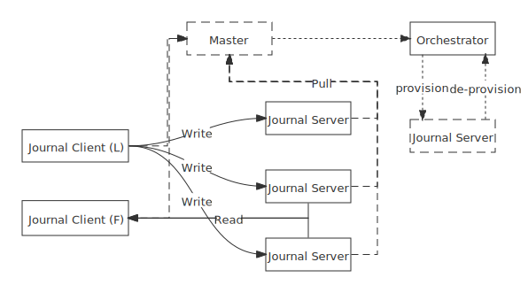

# Single write journal

- Status: accepted
- Pull Request: https://github.com/engula/engula/pull/280
- Tracking Issue: https://github.com/engula/engula/pull/284

## Abstraction

The luna engine needs a single-writing, multi-reading journal system.

## Design

### API

This has discussed in [#260](https://github.com/engula/engula/discussions/260). A trait named `SingleWriteJournal` is introduced to observe the role changes:

```rust
pub enum RoleState {
    Leader,
    Follower,
}

pub trait SingleWriteJournal : Journal {
    type Role;
    type Peer;
    type StateStream: Stream<Item = RoleState>;

    fn state(&self, name: &str) -> (Self::Role, Option<Self::Peer>);

    async fn observe_state(&self, name: &str) -> Self::StateStream;
}
```

The `SingleWriteJournal` doesn't affects the semantics of `Journal`, so `Journal::open_stream_writer` could be called whenever a stream isn't a leader. Of course, the implementation should guarantee that calls `StreamWriter::append` or other modifying operations will got a `Error::NotLeader`, if it isn't the stream leader.

### Architecture



A `SingleWriteJournal` consists of a master, journal orchestrator, a set of journal servers and a set of journal clients(which are parts of engine).

The journal server provides the durability of events of journal. All events are produced by journal client. At the same time, only one journal client could produce events which will be accepted by journal servers. That one is called leader, the other journal clients are followers.

The master is responsible for electing a new leader and detecting the leader's live. The master is also responsible for providing routers and balancing loads among journal servers. To scale the set of journal servers on-demand, the master provisions or de-provisions journal servers from the orchestrator.

#### Electing and Fault detecting

The master collects status and stats from both journal client and server periodic via heartbeat RPC requests. If the master haven't received heartbeats from the current leader after a while, it would choose a new client as the new leader, a set of servers as replication group, and assign a monotonic epoch to the new leader.

The order of events in a replication group is decided by the leader. In order to ensure the consistency of orders of events, before committing any events, a leader should ensure there no any events which produced by former leader would be accepted by journal servers. Via sealing RPC requests,  the new master requires all journal servers don't accepts any events with small epoch.

#### Replication Policy

A event will be replicated to all journal servers of a replication group eventually. Once an event is replicated to enough journal servers, which is specified by the replication policy, the event could be committed and applied to engine.

#### Reconfiguration

In general, a replication policy allows a journal server downtime unexpectedly, but does not affects the writing operations. In order to keep the availability in this situation, master would enforce leader to seal previous events and allocate new epoch so that it could change the configuration such as replication group to remove the faulted nodes.

#### Follower read

A leader will broadcast the committed sequence of events to all journal server, and those events is visible for reading. But here exists a gap between an event become committed in leader and an event is readable in a journal server. So a follower want to read events with consistency, it should ask the latest committed sequence from leader and wait until it receive those events.

### Future works

#### Chain replication

A leader might be the bottleneck, since it is responsible for replicating events to all journal servers. We could employ the chain replication mechanism that allow journal servers replicating events to other servers. Specially, a leader could use chain replication to replicate events to all followers.

#### Archive

After a series of events are sealed, those events could be put into s3 to reduce usage of local disk. Specially, user could manually archive some events to a cheap stores.
