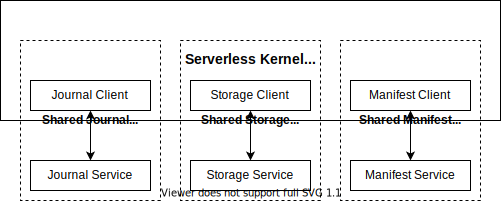

# Serverless Kernel

- Status: draft
- Pull Request:

## Introduction

`ServerlessKernel` provides the following features:

- Elasticity. The kernel should scale and provision resources automatically to serve dynamic workload.
- Multi-tenancy. One kernel deployment should be able to serve a lot of databases with resource isolation.
- High availability. The kernel should detect and recover failures automatically to provide reliable service.

## Architecture

`ServerlessKernel` unbundles its functionalities into different remote services. It consists of a kernel client, a `SharedJournal`, a `SharedStorage`, and a `SharedManifest`. The kernel client integrates the clients of different services to implement the `Kernel` interface.

`SharedJournal` and `SharedStorage` are described in other RFCs. `SharedManifest` provides metadata persistence and upper-level streams and objects management based on `SharedJournal` and `SharedStorage`.
