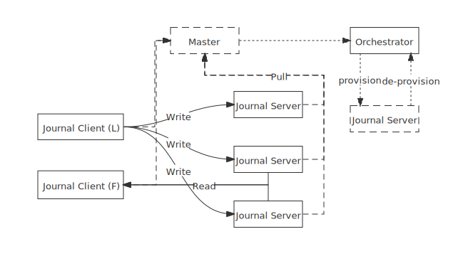

# Shared Journal

- Status: accepted
- Pull Request: https://github.com/engula/engula/pull/280
- Tracking Issue: https://github.com/engula/engula/pull/284

## Summary

We proposed an abstraction of leader-based journal in the previous RFC: [leader-based-journal](https://github.com/engula/engula/pull/280). In this RFC, we present `SharedJournal`, an implementation of leader-based journal.

Before reading the design documents, you should check the [journal](https://github.com/engula/engula/blob/main/docs/design.md#journal) section.

## Motivation

In the former RFC, the luna engine requires a leader so that journal must provide some mechanism such as fence token to achieve it. In order to shield electing details and improve reusability, we abstract this behavior to a trait named `LeaderBasedJournal`.

Now we present a design for `SharedJournal`, which focus primarily on :
- zero move: No data movement with reconfiguration
- separation of concerns: Separate configuration and log durable
- low latency: Achieve 1 RTT when an engine try to commit an event

In this RFC, we mainly discuss the overall framework of `SharedJournal` and the duties of each sub-modules, and the implementation details of each sub-modules are not considered.

## Design

### Architecture

A `SharedJournal` consists of a master, journal orchestrator, a set of journal servers and a set of journal clients(which are parts of engine).

The journal orchestrator is an abstraction that provisions and de-provisions journal servers. It depends on the specific running platform, such as k8s.

The journal server provides the durability of events of journal's stream. All events are produced by journal client, which implement trait `LeaderBasedJournal`. At the same time, for any stream only one journal client could produce events which will be accepted by journal servers. That one is called leader of the stream, the other journal clients interested in this stream are followers.

The master is responsible for electing a new leader and detecting the leader's live. The master is also responsible for providing routers and balancing loads among journal servers. To scale the set of journal servers on-demand, the master provisions or de-provisions journal servers from the journal orchestrator. As a part of out-of-band reconfiguration, the master must ensure the strong consistency of data persisting.

### Scale

A stream is unbounded and might exceeds the hardware limitation. In order to scale, a stream of a journal is divided into multiple segments which distributed in journal servers. At any given time, only one segment is writable, the others are sealed. As a result, the stream's leader could only append events to the latest segment.

The strategy for segment switching, could be defined on demand, such as switching if the size exceeds threshold. The segment switching is also a part of reconfiguration, which will be discussed in detail in the blow sections.

### Durable

We use multiple replicas to improve the durability. Here are two concepts are concerned to the durability.

#### Replication Policy

Replication policy decides that how many copies of events are successfully replicated is safe to commit a event.

#### Replication Group

Replication group is consists of a set of journal servers that all contain the same stream segment. The replication policy determines the number of servers in a group. An event will be replicated to all journal servers of a replication group eventually.

In general, replication policies should ensure that several replicas exist to avoid data loss due to a single machine crash. The faults are covered in reconfiguration section.

### Write & Read

Before a leader is ready to append events to journal server, it obtain the metadata of such stream from master:

- replication group
- replication policy

A leader will assigns a unique increasing sequence to a received event firstly. Then the leader broadcast events to all journal servers in the replication group. Once an event is replicated to enough journal servers, which is specified by the replication policy, the event could be committed and applied to engine.

The initial sequence number of a leader is recovery from previous segments, which will be discussed in detail in later sections.

A reader(both leader and followers) will subscribe the metadata and routers, from segment to journal server, from master. It fetches events from journal servers and aggregate them by the replication policy.

### Reconfiguration

Any operation that need to switch segments or change replication group are considered reconfiguration. Eg: electing, removing fault replica.

#### Electing

The master collects status and stats from both journal client and server periodic via heartbeat RPC requests. If the master haven't received heartbeats from the current leader after a while, it would choose a new client as the new leader, a set of servers as replication group, and assign a monotonic epoch to the new leader. Load balancing strategies can be applied to replication group selection.

The order of events in a replication group is decided by the leader. In order to ensure the consistency of orders of events, before committing any events, a leader should ensure there no any events which produced by former leader would be accepted by journal servers. Via sealing RPC requests, the new master requires all journal servers don't accepts any events with small epoch. This ensure consistency between leaders.

At the same time, the new leader need to learn the last allocated sequence number via the sealing RPC requests.

##### Recovery

// TODO(w41ter) This process is a bit complicated to explain, and I will add it when I have more time.

#### Replacing

In server side, the master will detects the fault servers.

For the sealed segments, if one of it's replica is lost by fault, the master will choose a new server and via a place RPC to enforce that server to restore the replica, by reading from the health replicas. If the number of surviving replicas doesn't satisfy the replication policy's requirements, manually repair is required. Once the journal server has restored the replica, the master could atomically replace the failed replica.

For appending segment, if one of it's replica is lost by fault, the master would enforce the leader to seal previous segment and allocate new epoch and choose a set of health journal server as the replication group. The fault of former segment will be replaced like the others sealed segments.

### Consistency

#### Write

The strong consistency between leaders is guaranteed by the strong consistency master and sealing operations. For the strong consistency of operations within same leader, an event that has been committed needs to wait until its previous operations have responded to the user before returning success.

#### Read

A leader will broadcast the committed sequence of events to all journal servers, and those events is visible for reading. But here exists a gap between an event become committed in leader and an event is readable in a journal server. So a follower want to read events with consistency, it should ask the latest committed sequence from leader and wait until it receive those events.

## Future works

### Chain replication

A leader might be the bottleneck, since it is responsible for replicating events to all journal servers. We could employ the chain replication mechanism that allow journal servers replicating events to other servers.

Specially, a leader could use chain replication to replicate events to all followers, so that a follower won't need to read events from journal indirectly.

### Archive

After a series of events are sealed, those events could be put into s3 to reduce usage of local disk. Specially, user could manually archive some events to a cheap stores.
