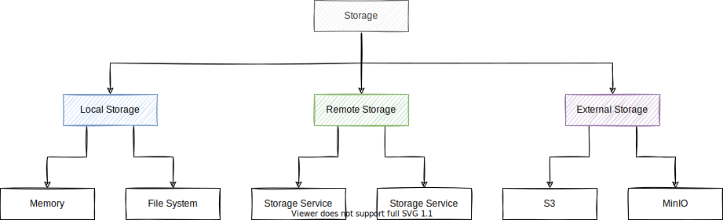

# Storage

This document describes the top-level design of Storage.

Storage provides an abstraction to store data as objects.
Storage can be used as a standalone component or integrated with Engula.

## Semantics

Storage divides data into buckets.
A bucket stores a set of data objects.
Each bucket has a unique identifier called the bucket name.
Each object has an identifier that is unique within the bucket called the object name.
Objects are immutable once created.

Storage provides the following interfaces to manipulate buckets:

- Create a bucket with a unique bucket name
- Delete a bucket
- List buckets

Storage provides the following interfaces to manipulate objects:

- Upload an object to a bucket
- Delete an object from a bucket
- List objects in a bucket
- Read a part of an object at a specific position

It is also possible to support object-level expression evaluation for some object formats (e.g., CSV, JSON, Parquet), which is important to analytical workloads.
We leave the exploration in this area to future work.

## Guidelines

Storage can be implemented in the following forms:

- Local Storage: a module that stores data in memory or file system.
- Remote Storage: a client that stores data in multiple remote services.
- External Storage: a client that stores data in various third-party services.

It is a good idea to combine different implementations into a more powerful storage.
For example, we can create a hybrid storage that persists data to a slow but highly-durable storage and then reads data from a fast and highly-available storage.
Another example is to create a tiered storage that separates data into multiple tiers according to data hotness.

However, Storage doesn't assume how data should be persisted or replicated.
It is up to the implementer to decide what guarantees it provides.
Users can choose an appropriate implementation for their applications.

## Discussions

Casual discussions about the design and implementation should be proceeded in the [forum][storage-discussion].
Formal discussions about the design of a specific implementation should be submitted as an RFC.

[storage-discussion]: https://github.com/engula/engula/discussions/79
