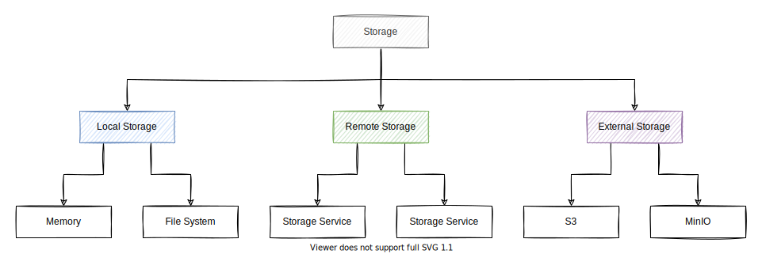

# Storage

This document describes the top-level design of Storage.

Storage provides an abstraction to store data objects.
Storage can be used as a standalone component or integrated with Engula.

## Semantics

Storage divides data into buckets.
A bucket stores a set of data objects.
Each bucket has a unique identifier called the bucket name.
Each object has an object name that is unique within a bucket.
Objects are immutable once created.

Storage provides the following interfaces to manipulate buckets:

- List buckets
- Create a bucket with a unique bucket name
- Delete a bucket

Storage provides the following interfaces to manipulate objects in a bucket:

- List objects
- Upload an object
- Delete an object
- Read a range from an object at a specific position

It is also possible to support object-level expression evaluation for some object formats (e.g., CSV, JSON, Parquet), which is important to analytical workloads.
We leave the exploration of this feature to future work.

Storage is a low-level abstraction to manipulate individual objects. It doesn't support atomic operations across multiple objects.
See [Warehouse](warehouse.md) for a high-level abstraction that provides more powerful semantics.

## Guidelines

Storage can be implemented in the following forms:

- Local Storage: a module that stores data in memory or file system.
- Remote Storage: a client that stores data in multiple remote services.
- External Storage: a client that stores data in various third-party services.

It is a good idea to combine different implementations into a more powerful one.
For example, we can create a hybrid storage that persists data to a slow but highly-durable storage and then reads data from a fast and highly-available storage.
Another example is to create a tiered storage that separates data with different hotness into multiple tiers, which provide different cost-performance trade-offs.

Storage doesn't assume how data should be persisted.
It is up to the implementer to decide what guarantees it provides.
Users can choose an appropriate implementation for their applications.

## Discussions

Casual discussions about the design and implementation should proceed in [this discussion][storage-discussion].
Formal discussions about the design of a specific implementation should proceed with an RFC.

[storage-discussion]: https://github.com/engula/engula/discussions/79