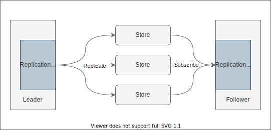

# Stream Engine

This document describes the detailed design of Stream Engine.

## Architecture

Stream Engine is a low latency, fault-tolerant, scalable and durable stream system. It servers as a single producer multiple consumer.

A Stream Engine deployment consists of a Master and a collection of Segment Stores.

The segment stores are responsible for providing data durability and subscription. The master is responsible for metadata access and persistence, balance load among stores, and election arbitration.

Some other mechanisms such as leader elections, events replication, and segment recovery are implemented in the client of Stream Engine, to achieve lower latency.

### Overview

Leaving the concept of multiple tenants aside, Stream Engine is responsible for maintaining a append only stream, which consists of a collection of **events** proposed by users.

#### Scalable

A stream's number of events is unrestricted, its size might exceeds the hardware limitation. In order to achieve scalability, a stream is divided into multiple **segments** and distributed across various segment stores.

All events are replicated to the last segment. When a segment meets certain conditions, such as the size exceeds the threshold, leadership transferred (introduced in [leader election and recovery](#leader-election-and-safety)), it would be **sealed** (introduced in [recovery](#recovery)) and a new segment is created to serve new events.

#### Durable

Hardware failures can happen at any time, and to ensure data durability, each one of events proposed by users is replicated to multiple segment stores. That is, each segment has multiple **replicas**, and the events are complete as long as enough replicas exists. These segment stores that contains replicas of the same segment form a **copy set**. The consistency between replicas is resolved by the [replication policy](#replication-policy). When a event is replicated to enough segment stores (config in replication policy), it is **acked** and could be read.

#### Fault Tolerance

Like the segment stores, the hardware where a stream engine client is running might fail at any time, and a standby client is needed to tolerant failures and achieve availability.

At the same time, a stream only have one client could append events (in other words, only one of events proposed in parallel could be acked). The different client are coordinated by **leader election**, and only the leader proposed events will be acked by stream engine.

##### Leader Election and Safety

Each client randomly initiates an election which is then arbitrated by the master. Periodically, a client sends a **heartbeat** request to master. The master will choose a client at random to grant leader lease to, and it will renew leader lease each time it receives a heartbeat from the leader. Within a lease, the master guarantees that another client will not be elected as the leader. If the master does not receive a heartbeat from the leader after the lease expires, it will re-elect a new client as the leader.

Sometimes due to network issues, the heartbeat of a leader does not always arrive at the master on time, so a new leader might be elected to serve, and the old leader unaware that it has lost its leader lease. Then two leaders will be replicating their events at the same time. In extreme cases, a request from old leader may arrive at the segment stores after a request from new leader. To solve this problem, the segment store introduces a mechanism similar to the fence token.

In addition to leases, each time a leader is elected, the master also assigns it a unique monotonically increasing number, termed **epoch**. Before starting to replicate events, a leader must send a **seal** request to segment stores, which includes the leader's epoch. Once the seal request has been received, the segment store will guarantee that it will not receive any requests with a small epoch.

This process is called **replica sealing**. Only the number of received requests satisfied the replication policy requirement, could the leader begin replicating events, as it ensured that no any events from previous epoch would be acked by stream engine.

##### Recovery

A leader will assign a unique **index** to an event, and broadcast it in order. When a working leader goes down unexpectedly, the segment stores may contain some inconsistent replicas of events. In a majority replication policy, for example, the leader receives the responses from majority and returns success to the user by calculating the number of replicas (to achieve the lowest possible latency), and asynchronously broadcasting **acked index** to all segment stores. If that leader dies before broadcasting, the new leader will have to recalculate which events have been acked (as users may already be aware) in order to maintain external consistency.

In the "replica sealing" response, each segment store will carry they known acked index. Starting with the largest acked index, the new leader must read events from all segment stores and replicate them to other segment stores. Ultimately, all events are acked and no inconsistent replicas of events in the segment stores. Once the above steps have been completed, the segment can be marked as sealed by the leader. The process described in above is call **segment sealing** or **recovery**.

The recovery process could consume a lot of time, the new leader might not be able to ack events during the intervals. In addition to recovery, the leader allows events to be replicated in order to reduce latency. However, new events can only be acked if all previous segment have been sealed to maintain consistency. This is called **parallel replicating and recovering**. Only two unsealed segment are allowed here for simplicity. The leader will not be able to replicate events if there already exists two unsealed segments.

### Replication Policy

Leader broadcasts events and acked index to copy set of segment. Followers consume stream events by subscribing acked events from the copy set of segment. The replication policy is in charge of dealing with and resolving issues of consistency between replicas in above process.

The purpose of replication policy is to:
1. determine the minimum number of replicas that can ack an event;
2. resolve conflicting events during recovery;
3. resolve conflicting events during subscribing;

The replication policy's implementation determines the exact details. NRW or flexible quorum, for example, can be chosen as an implementation.

### Segment Store

The segment store manages events by segment. In general, a leader always replicates events in order, but the segment store may selectively discard some events due to back pressure, so there might exists a hole in events of a segment. If the segment store receives a event but former one are missed, it returns the largest consecutive index as the **matched index** to the leader. The leader could select and retransmit events according the matched index.

#### Entry and Epoch

During recovering, the leader also has to deal with holes exists in segment store events. In order to express holes, the structure `Entry` is used when communicating between the stream engine and segment stores, which has three types:

1. event
2. hole
3. bridge

When a leader recovers non-consecutive events, it must replicate a sequence of hole entries to fill the hole, but this may cause confusion for events readers. Consider an NRW replication policy, where N = 3 and both R and W are 2. There are three segment stores in a segment's copy set, named A, B, C. A leader 1 replicates entries `{e(1), e(2), e(3)}` to them. Before leader 1 crash, the entries of A, B, C are `{e(1), e(2), e(3)}`, `{e(1), e(3)}`, `{e(1), e(3)}`. Suppose a new leader 2 starts to recover, it reads B, C and adds a hole entry and replicate it to B, C, now the entries of A, B, C, are `{e(1), e(2), e(3)}`, `{e(1), h(2), e(3)}`, `{e(1), h(2), e(3)}`. At the same time, a follower 3 reads A, B, find two conflicting entries in index 2.

So that each entry records the epoch of the leader who replicated it. Even while recovering, the new leader must update the entry's epoch and re-replicate it to the segment stores of copy set.

The goal of bridge entry is straightforward. It is used to inform the reader that the segment has come to an end and that they must move on to the next segment. When a leader recovering former segment, it must append a bridge entry to the end of segment.

### Master

The master is a global decision maker that can detect and replace fault segment stores to ensure data durability. For sealed segments, the master could perform scheduling tasks to add a replica to another segment store while also removing the failed replica from the copy set. For the segment isn't sealed, the master could actively promote the leader, causing it to switch segment and seal the previous segment.

## Future Work

### Reading consistency

Now, the read request is to get the acked events from the segment stores, which has a lag from the client's observation of the acked (the interval between the broadcast of the acked index to the segment store). In the future, we could also allow un-acked events to be read from the segment store and use the same methods as the leader to calculate acked events to avoid this latency gap.

### Chain replication

Now, an event is broadcast to each segment store in the copy set through the leader. In the future, we could add a chain replication strategy, where the leader only replicate events to one segment store, and that segment store continuously replicate events to next segment store, and soon. Eventually all segment stores have been successfully received events.

