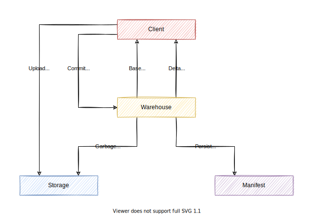

# Warehouse

This document describes the top-level design of Warehouse.

Warehouse is a high-level object storage abstraction based on [Storage](storage.md) and Manifest.
Warehouse enhances Storage with versioned metadata and atomic metadata operations to serve the following scenarios:

- Foreground queries that need to make sure that their required data remains valid during execution
- Background jobs that need to add or remove multiple objects atomically to guarantee data correctness

## Architecture

Warehouse stores object data in Storage and stores object metadata in Manifest.

To add objects to Warehouse, a client uploads objects to Storage first and then commits the uploaded objects to Warehouse.
To delete objects from Warehouse, a client commits the to be deleted objects to Warehouse and relies on Warehouse to delete those objects.
It is possible that a client fails to upload an object or fails to commit the uploaded objects. In this case, the corresponding objects become obsolete.
Warehouse relies on garbage collection to purge obsoleted or to be deleted objects in the end.

Warehouse employs a multi-version mechanism to manage metadata.
It maintains multiple versions of metadata. Each version represents a snapshot of metadata at a specific time.
Each metadata transaction (add or remove objects) creates a delta version that transforms the last version into a new one.
When a client connects to Warehouse, it gets the last version from Warehouse as its base version and then subscribes to delta versions.
When a delta version arrives, the client applies it to the base version to catch up with Warehouse.
The client can maintain a list of live versions for ongoing queries and release a version once it is no longer required.
Warehouse guarantees that objects recorded in all client versions remain valid until the corresponding versions are released.
