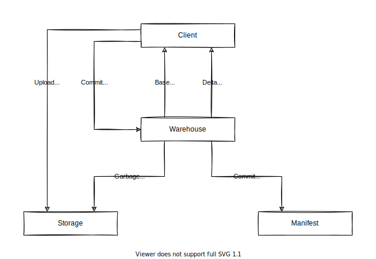

# Warehouse

This document describes the top-level design of Warehouse.

Warehouse is a higher-level object storage abstraction based on [Storage](storage.md).
Warehouse enhances Storage with versioned metadata and atomic metadata operations.

## Architecture

Warehouse stores object data in Storage and stores object metadata in Manifest.

Warehouse provides the following interfaces to manipulate metadata:

- Atomic commits to add or remove multiple objects
- Retrieve the base version and subscribe to delta version changes
